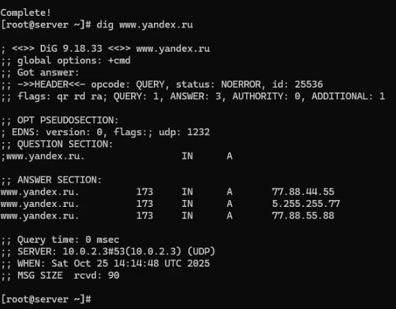
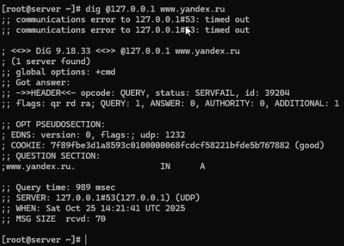
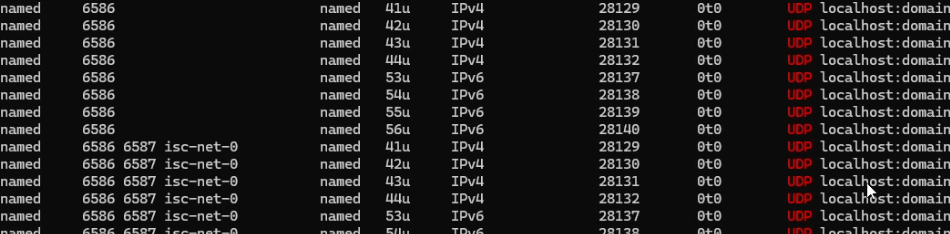
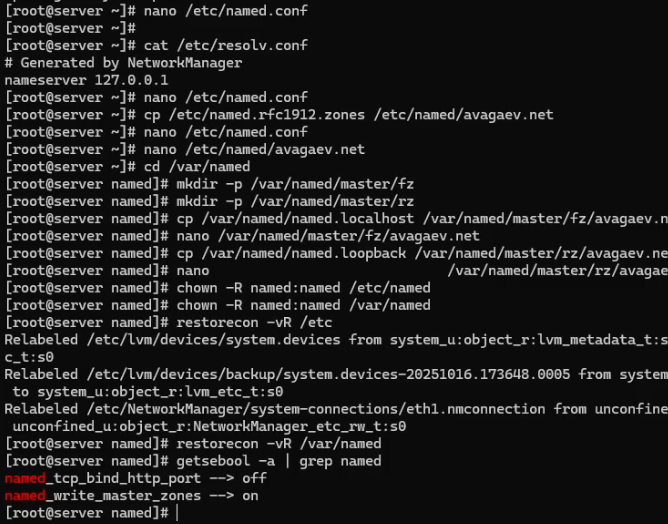
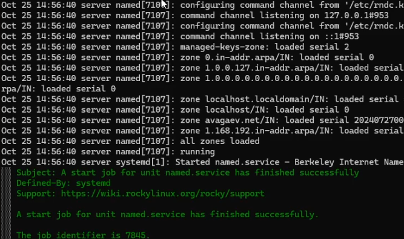
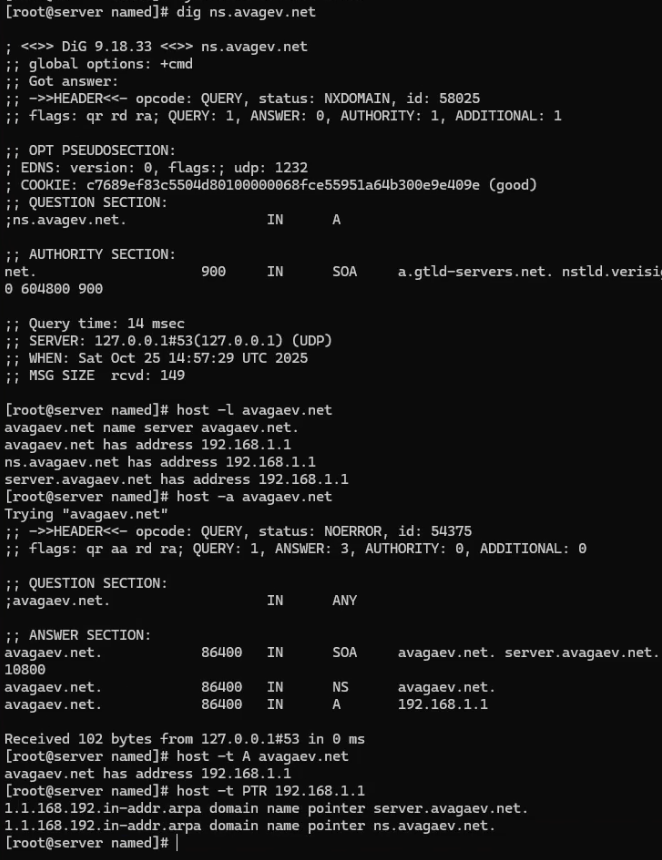

---
## Author
author:
  name: Арсений Валерьевич Агаев
  email: 1032221668@rudn.ru
  affiliation:
    - name: Российский университет дружбы народов
      country: Российская Федерация
      postal-code: 117198
      city: Москва
      address: ул. Миклухо-Маклая, д. 6
## Title
title: Лабораторная работа №2
subtitle: Настройка DNS-сервера
license: CC BY
date: today
date-format: "YYYY-MM-DD" # Example: 2025-09-06
---
# Информация

## Докладчик

:::::::::::::: {.columns align=center}
::: {.column width="70%"}

  * Арсений Валерьевич Агаев
  * студент
  * Российский университет дружбы народов им. П. Лумумбы
  * [1032221668@rudn.ru](mailto:1032221668@rudn.ru)

:::
::: {.column width="30%"}

:::
::::::::::::::

# Цели и задачи

Приобрести практические навыки по установке и конфигурированию DNS-сервера, усвоить принципы работы системы доменных имён.

- Установить на виртуальной машине ```server``` DNS-сервер bind и bind-utils

- Сконфигурировать на виртуальной машине ```server``` кэширующий DNS-сервер

- Сконфигурировать на виртуальной машине ```server``` первичный DNS-сервер

- При помощи утилит dig и host проанализировать работу DNS-сервера

- Написать скрипт для Vagrant, фиксирующий проделанную работу по установке и конфигурированию DNS-сервера

# Содержание исследования

## Установка DNS-сервера

Сначала установил bind и bind-utils:

```
dnf -y install bind bind-utils
```

Сделал запрос к DNS-адресу ```www.yandex.ru``` ([рис. @fig-001]):

{#fig-001 width=70%}

## Конфигурирование кэширующего DNS-сервера

Запустил DNS-сервер:

```
systemctl enable named
systemctl start named
```

Выполнил DNS-запрос через локальный сервер:

```
dig @127.0.0.1 www.yandex.ru
```

## Конфигурирование кэширующего DNS-сервера

{#fig-002 width=70%}

## Конфигурирование кэширующего DNS-сервера

После я назначил его сервером по умолчанию для хоста и внутренней виртуальной сети:

```
nmcli connection edit eth0
remove ipv4.dns
set ipv4.ignore-auto-dns yes
set ipv4.dns 127.0.0.1
save
quit
```

Соединение ```System eth0``` не было обнаружено.

Перезапустил NetworkManager:

```
systemctl restart NetworkManager
```

## Конфигурирование кэширующего DNS-сервера

После внес изменения в конфигурационный файл ```/etc/named.conf```:

```conf
...
listen-on port 53 { 127.0.0.1; any; };
...
allow-query	{ localhost; 192.168.0.0/16; };
```

Внес изменения в firewalld:

```
firewall-cmd --add-service=dns
firewall-cmd --add-service=dns --permanent
```

Проверил, что сервер слушает 53 порт:

```
lsof | grep UDP
```

## Конфигурирование кэширующего DNS-сервера

{#fig-003 width=70%}

## Конфигурирование кэширующего DNS-сервера

Также добавил перенаправление DNS-запросов к вышестоящему серверу, добавив строку в ```/etc/named.conf```:

```conf
forwarders { 1.1.1.1; 8.8.8.8; };
forward first;
```

## Конфигурирование первичного DNS-сервера

Вначале я скопировал шаблон описания DNS-зон и переименовал его:

```
cp /etc/named.rfc1912.zones /etc/named/
cd /etc/named
mv /etc/named/named.rfc1912.zones /etc/named/avagaev.net
```

Включил данный файл в конфигурационный файл ```/etc/named.conf```:

```conf
include "/etc/named/avagaev.net";
```

Затем начал редактирование данного файла:

```conf
...
zone "avagaev.net" IN {
      type master;
      file "master/fz/avagaev.net";
      allow-update { none; };
};
...
zone "1.168.192.in-addr.arpa" IN {
      type master;
      file "master/rz/192.168.1";
      allow-update { none; };
};
```

## Конфигурирование первичного DNS-сервера

В каталоге ```/var/named``` создал соответствующие подкаталоги для файлов прямой и обратной зоны:

```
cd /var/named
mkdir -p /var/named/master/fz
mkdir -p /var/named/master/rz
```

Сами файлы скопировал с шаблонов:

```
cp /var/named/named.localhost /var/named/master/fz/
cd /var/named/master/fz/
mv named.localhost avagaev.net

cp /var/named/named.loopback /var/named/master/rz/
cd /var/named/master/rz/
mv named.loopback 192.168.1
```

## Конфигурирование первичного DNS-сервера

Отредактировал файл ```/var/named/master/fz/avagaev.net```:

```conf
$TTL 1D
@                       IN SOA  @ server.avagaev.net. (
                                2025102601 ; serial
                                86400      ; refresh
                                3600       ; retry
                                604800     ; expire
                                10800      ; minimum
                                )
                        NS      @
                        A       192.168.1.1
$ORIGIN avagaev.net.
ns                      A       192.168.1.1
server                  A       192.168.1.1
```

## Конфигурирование первичного DNS-сервера

Отредактировал файл ```/var/named/master/rz/192.168.1```:

```conf
$TTL 1D
@                       IN SOA  @ server.avagaev.net. (
                                2025102601 ; serial
                                86400      ; refresh
                                3600       ; retry
                                604800     ; expire
                                10800      ; minimum
                                )
                        NS      @
                        A       192.168.1.1
                        PTR     server.avagaev.net.
$ORIGIN 1.168.192.in-addr.arpa.
1                       PTR     server.avagaev.net.
1                       PTR     ns.avagaev.net.
```

## Конфигурирование первичного DNS-сервера

Далее исправил права доступа к каталогам и восстановил метки SELinux:

```
chown -R named:named /etc/named
chown -R named:named /var/named

restorecon -vR /etc
restorecon -vR /var/named
```

Проверил состояния переключателей SELinux:

```
getsebool -a | grep named
```

## Конфигурирование первичного DNS-сервера

{#fig-004 width=70%}

## Конфигурирование первичного DNS-сервера

В дополнительном терминале запустил расщиренный лог системных сообщений:

```
journalctl -x -f
```

И перезапустил DNS-сервер:

```
systemctl restart named
```

## Конфигурирование первичного DNS-сервера

{#fig-005 width=70%}

## Анализ работы DNS-сервера

Получил описание DNS-зоны с сервера:

```
dig ns.avagaev.net
```

Проанализировал корректность работы DNS-сервера:

```
host -l avagaev.net
host -a avagaev.net
host -t A avagaev.net
host -t PTR 192.168.1.1
```

## Анализ работы DNS-сервера

{#fig-006 width=70%}

## Внесение изменений в настройки внутреннего окружения виртуальных машин

На ВМ ```server``` перешел в каталог для внесения изменений в настройки внутреннего окружения 
```/vagrant/provision/server``` и зафиксировал проведенную работу:

```
cd /vagrant

mkdir -p /vagrant/provision/server/dns/etc/named
mkdir -p /vagrant/provision/server/dns/var/named/master

cp -R /etc/named.conf /vagrant/provision/server/dns/etc/
cp -R /etc/named/* /vagrant/provision/server/dns/etc/named/
cp -R /var/named/master/* \
   /vagrant/provision/server/dns/var/named/master/

touch dns.sh
chmod +x dns.sh
```

## Внесение изменений в настройки внутреннего окружения виртуальных машин

В файл ```/vagrant/provision/server/dns.sh``` записал скрипт:

```sh
#!/bin/bash

echo "Provisioning script $0"

echo "Install needed packages"
dnf -y install bind bind-utils

echo "Copy configuration files"
cp -R /vagrant/provision/server/dns/etc/* /etc
cp -R /vagrant/provision/server/dns/var/named/* /var/named

chown -R named:named /etc/named
chown -R named:named /var/named

restorecon -vR /etc
restorecon -vR /var/named

echo "Configure firewall"
firewall-cmd --add-service=dns
firewall-cmd --add-service=dns --permanent

echo "Tuning SELinux"
setsebool named_write_master_zones 1
setsebool -P named_write_master_zones 1

echo "Change dns server address"
nmcli connection edit "eth0" <<EOF
remove ipv4.dns
set ipv4.ignore-auto-dns yes
set ipv4.dns 127.0.0.1
save
quit
EOF
systemctl restart NetworkManager

echo "Start named service"
systemctl enable named
systemctl start named
```

## Внесение изменений в настройки внутреннего окружения виртуальных машин

Для отработки данных скриптов, внес изменения в Vagrantfile в соответсвующую секцию:

```conf
server.vm.provision "server dns",
   type: "shell",
   preserve_order: true,
   path: "provision/server/dns.sh"
```

# Результаты

Я успешно приобрёл практические навыки по установке и конфигурированию DNS-сервера и усвоил принципы работы системы доменных имён.
