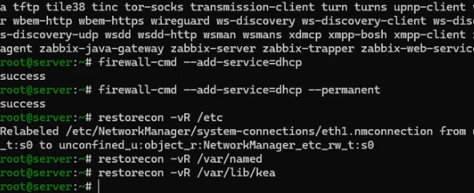
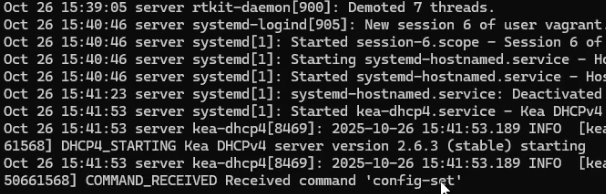
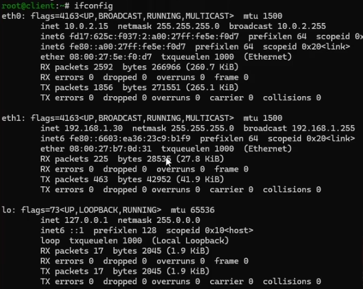
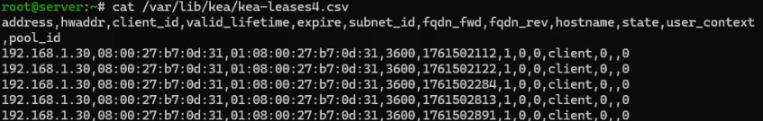
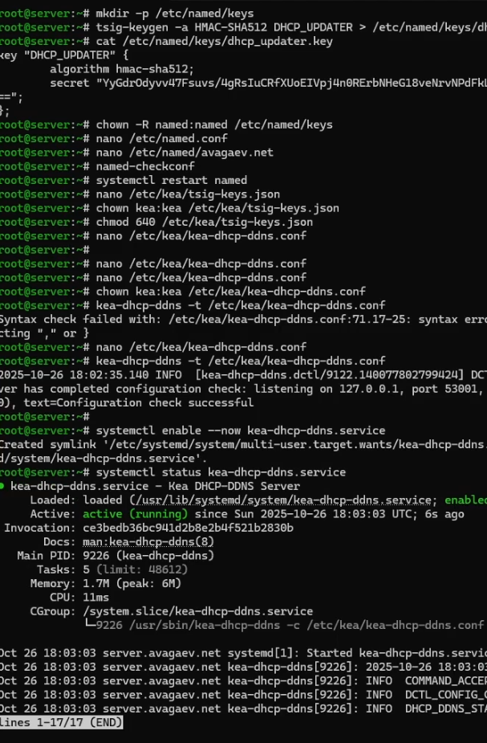
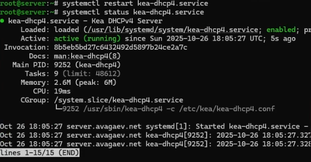
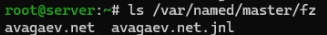
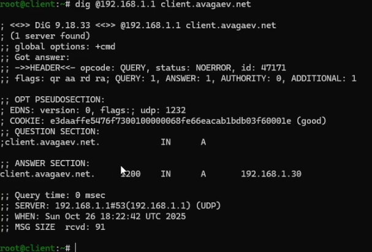

---
## Author
author:
  name: Арсений Валерьевич Агаев
  email: 1032221668@rudn.ru
  affiliation:
    - name: Российский университет дружбы народов
      country: Российская Федерация
      postal-code: 117198
      city: Москва
      address: ул. Миклухо-Маклая, д. 6

## Title
title: "Лабораторная работа №3"
subtitle: "Настройка DHCP-сервера"
license: "CC BY"
---

# Цель работы

Приобрести практические навыки по установке и конфигурированию DHCP-сервера.

# Задание

- Установить на ВМ ```server``` DHCP-сервер

- Настроить ВМ ```server``` в качестве DHCP-сервера

- Проверить корректность работы DHCP-сервера

- Настроить  обновление DNS-зоны при появлении новых узлов

- Проверить корректность работы DHCP-сервера и обновления DNS-зоны

- Написать скрипт для Vagrant, фиксирующий действия по установке и настройке DHCP-сервера

# Выполнение лабораторной работы

## Установка DHCP-сервера

Под суперпользователем я установил dhcp:

```
dnf -y install kea
```

## Конфигурирование DHCP-сервера

Перед модификацией конфигурационного файла, я делаю его копию:

```
cp /etc/kea/kea-dhcp4.conf /etc/kea/kea-dhcp4.conf__$(date -I)
```

После открываю его и изменяю стандартные значения на свои:

```conf
"interfaces-config": {
  "interfaces": [ "eth1" ]
},
...
{ 
  "code": 15,
  "data": "avagaev.net"
},
{
  "name": "domain-search",
  "data": "avagaev.net"
},
...
{ 
  "name": "domain-name-servers",
  "data": "192.168.1.1"
},
...
"subnet4": [
  {
    "id": 1,
    "subnet": "192.168.1.0/24",
    "pools": [ { "pool": "192.168.1.30 - 192.168.1.199" } ],
    "option-data": [
      {
        "name": "routers",
        "data": "192.168.1.1"
      }
    ]
  }
],
```

После проверил правильность файла:

```
kea-dhcp4 -t /etc/kea/kea-dhcp4.conf
```

И перезапустил конфигурацию:

```
systemctl --system daemon-reload
systemctl enable kea-dhcp4.service
```

Добавил записи в

файл ```/var/named/master/fz/avagaev.net```:

```conf
dhcp	A	192.168.1.1
```

и в файл ```/var/named/master/rz/192.168.1```:

```conf
1	PTR	dhcp.avagaev.net.
```

И перезапустил named и проверил доступность DHCP-сервера:

```
systemctl restart named

ping dhcp.avagaev.net
```

После внес изменения в настройки межсетевого экрана и восстановил контекст безопасности SELinux:

```
firewall-cmd --add-service=dhcp
firewall-cmd --add-service=dhcp --permanent

restorecon -vR /etc
restorecon -vR /var/named
restorecon -vR /var/lib/kea/
```

{#fig-001 width=70%}

В дополнительном терминали запустил мониторинг происходящих процессов ([рис. @fig-002]):

```
tail -f /var/log/messages
```

И запустил DHCP-сервер в основном терминале:

```
systemctl start kea-dhcp4.service
```

{#fig-002 width=70%}

## Анализ работы DHCP-сервера

В лабораторной работе 1 я уже создавал скрипт ```01-routing.sh``` на ВМ ```client```, 
поэтому сразу перехожу запуску клиента:

На ВМ ```client``` посмотрел информацию об имеющихся интерфейсах ([рис. @fig-003]):

{#fig-003 width=70%}

На ВМ ```server``` посмотрел список выданных адресов ([рис. @fig-004]):

{#fig-004 width=70%}

## Настройка обновления DNS-зоны

Создал ключ на сервере и выдам правильные права:

```
mkdir -p /etc/named/keys
tsig-keygen -a HMAC-SHA512 DHCP_UPDATER > /etc/named/keys/dhcp_updater.key
chown -R named:named /etc/named/keys
```

После подключил ключ в файле ```/etc/named.conf```:

```conf
include "/etc/named/keys/dhcp_updater.key";
```

Соответствующим образом отредактировал ```/etc/named/avagev.net```:

```conf
zone "avagaev.net" IN {
  type master;
  file "master/fz/avagaev.net";
  update-policy {
    grant DHCP_UPDATER wildcard *.avagaev.net A DHCID;
  };
};
zone "1.168.192.in-addr.arpa" IN {
  type master;
  file "master/rz/192.168.1";
  update-policy {
    grant DHCP_UPDATER wildcard *.1.168.192.in-addr.arpa PTR DHCID;
  };
};
```

После проверил конфигурацию и перезапустил:

```
named-checkconf
systemctl restart named
```

Сформировал ключ ```/etc/kea/tsig-keys.json``` в формате JSON:

```json
"tsig-keys": [
  {
    "name": "DHCP_UPDATER",
    "algorithm": "hmac-sha512",
    "secret": "YyGdrOdyvv47Fsuvs4gRsIuCRfXUoEIVpj4n0RErbNHeG18veNrvNPdFkL1bDPGzdbVKbz8idRC4AjrtZ8nxQ=="
  }
],
```

Сменил владельца и поправил права доступа:

```
chown kea:kea /etc/kea/tsig-keys.json
chmod 640 /etc/kea/tsig-keys.json
```

Настроил файл ```/etc/kea/kea-dhcp-ddns.conf```:

```conf
{ 
  "DhcpDdns": {
    "ip-address": "127.0.0.1",
    "port": 53001,
    "control-socket": {
      "socket-type": "unix",
      "socket-name": "/run/kea/kea-ddns-ctrl-socket"
    },
    <?include "/etc/kea/tsig-keys.json"?>
    "forward-ddns" : {
      "ddns-domains" : [
        {
          "name": "avagaev.net.",
          "key-name": "DHCP_UPDATER",
          "dns-servers": [
             { "ip-address": "192.168.1.1" }
          ]
        }
      ]
    },
    "reverse-ddns" : {
      "ddns-domains" : [
        {
          "name": "1.168.192.in-addr.arpa.",
          "key-name": "DHCP_UPDATER",
          "dns-servers": [
             { "ip-address": "192.168.1.1" }
          ]
        }
      ]
    },
    "loggers": [
      {
        "name": "kea-dhcp-ddns",
        "output_options": [
           {
             "output": "stdout",
             "pattern": "%-5p %m\n"
           }
        ],
        "severity": "INFO",
        "debuglevel": 0
      }
    ]
  }
}
```

Изменил владельца файла:
 
```
chown kea:kea /etc/kea/kea-dhcp-ddns.conf
```
 
Проверил файл на синтаксические ошибки:
  
```
kea-dhcp-ddns -t /etc/kea/kea-dhcp-ddns.conf
```

И запустил службу ddns:

```
systemctl enable --now kea-dhcp-ddns.service
```

Проверил ее статус ([рис. @fig-005]):

```
systemctl status kea-dhcp-ddns.service
```

{#fig-005 width=70%}

Внес изменения в ```/etc/kea/kea-dhcp4.conf```:

```conf
"dhcp-ddns": {
  "enable-updates": true
},
"ddns-qualifying-suffix": "avagaev.net",
"ddns-override-client-update": true,
...
```

Проверил на синтакстические ошибки:

```
kea-dhcp4 -t /etc/kea/kea-dhcp4.conf
```

Перезапустил и проверил статус ([рис. @fig-006]):

```
systemctl restart kea-dhcp4.service
systemctl status kea-dhcp4.service
```

{#fig-006 width=70%}

На ВМ ```client``` переполучил адрес:

```
nmcli connection down eth1
nmcli connection up eth1
```

В каталоге прямой зоны появился файл ```avagaev.net.jnl```:

{#fig-007 width=70%}

## Анализ работы DHCP-сервера после настройки обновления DNS-зоны

На ВМ ```client``` проверил запись о клиенте:

```
dig @192.168.1.1 client.avagaev.net
```

{#fig-008 width=70%}

## Внесение изменений в настройки внутреннего окружения виртуальных машин

На ВМ ```server``` перешел в каталог для внесения изменений в настройки внутреннего окружения 
```/vagrant/provision/server``` и зафиксировал проведенную работу:

```
cd /vagrant/provision/server

mkdir -p /vagrant/provision/server/dhcp/etc/kea
cp -R /etc/kea/* /vagrant/provision/server/dhcp/etc/kea/

cp -R /var/named/* /vagrant/provision/server/dns/var/named/
cp -R /etc/named/* /vagrant/provision/server/dns/etc/named/

touch dhcp.sh
chmod +x dhcp.sh
```

В файл ```/vagrant/provision/server/dhcp.sh``` записал скрипт:

```sh
#!/bin/bash

echo "Provisioning script $0"

echo "Install needed packages"
dnf -y install kea

echo "Copy configuration files"
cp -R /vagrant/provision/server/dhcp/etc/kea/* /etc/kea/

echo "Fix permissions"
chown -R kea:kea /etc/kea
chmod 640 /etc/kea/tsig-keys.json

restorecon -vR /etc
restorecon -vR /var/lib/kea

echo "Configure firewall"
firewall-cmd --add-service dhcp
firewall-cmd --add-service dhcp --permanent

echo "Start dhcpd service"
systemctl --system daemon-reload
systemctl enable --now kea-dhcp4.service
systemctl enable --now kea-dhcp-ddns.service
```

Для отработки данных скриптов, внес изменения в Vagrantfile в соответсвующую секцию:

```conf
server.vm.provision "server dhcp",
   type: "shell",
   preserve_order: true,
   path: "provision/server/dhcp.sh"
```

# Выводы

Я приобрёл практические навыки по установке и конфигурированию DHCP-сервера.

