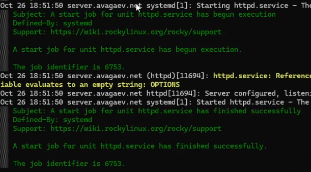
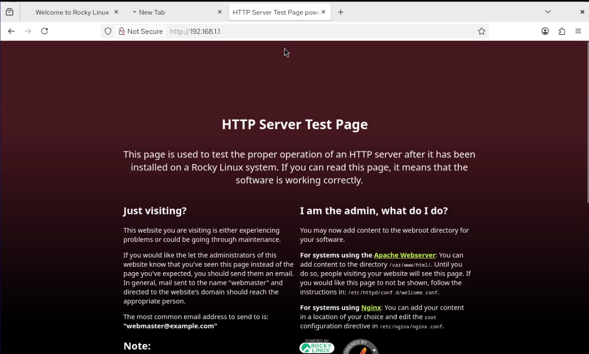
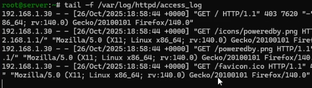
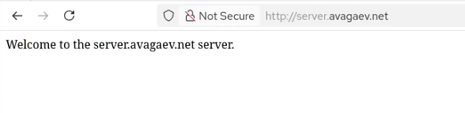

---
## Author
author:
  name: Арсений Валерьевич Агаев
  email: 1032221668@rudn.ru
  affiliation:
    - name: Российский университет дружбы народов
      country: Российская Федерация
      postal-code: 117198
      city: Москва
      address: ул. Миклухо-Маклая, д. 6
## Title
title: Лабораторная работа №4
subtitle: Базовая настройка HTTP-сервера Apache
license: CC BY
date: today
date-format: "YYYY-MM-DD" # Example: 2025-09-06
---
# Информация

## Докладчик

:::::::::::::: {.columns align=center}
::: {.column width="70%"}

  * Арсений Валерьевич Агаев
  * студент
  * Российский университет дружбы народов им. П. Лумумбы
  * [1032221668@rudn.ru](mailto:1032221668@rudn.ru)

:::
::: {.column width="30%"}

:::
::::::::::::::

# Цели и задачи

Приобрести практические навыки по установке и базовому конфигурированию HTTP-сервера Apache.

- Установить необходимые для работы HTTP-сервера пакеты

- Запустить HTTP-сервер с базовой конфигурацией и проанализировать его работу

- Настроить виртуальный хостинг

- Написать скрипт для Vagrant, фиксирующий действия по установке и настройке HTTP-сервера.

# Содержание исследования 

## Установка HTTP-сервера

Установил из репозитория стандартный веб-сервер, посредством установки группы:

```
LANG=C yum grouplist
dnf -y groupinstall "Basic Web Server"
```

## Базовое конфигурирование HTTP-сервера

Настроил межсетевой экран для работы HTTP-сервера:

```
firewall-cmd --add-service=http
firewall-cmd --add-service=http --permanent
```

В дополнительном терминале запустил расширенный мониторинг системных сообщений:

```
journalctl -x -l
```

Запустил сервер:

```
systemctl enable httpd
systemctl start httpd
```

## Базовое конфигурирование HTTP-сервера

{#fig-001 width=70%}

## Анализ работы HTTP-сервера

На ВМ ```server``` в двух окнах запустил мониторинг ошибок и доступа к HTTP-серверу:

```
tail -f /var/log/httpd/error_log

tail -f /var/log/httpd/access_log
```

На ВМ ```client``` через браузер зашел на страницу сервера по адресу ```192.168.1.1```:

## Анализ работы HTTP-сервера

{#fig-002 width=70%}

## Анализ работы HTTP-сервера

Сообщения в логах:

{#fig-003 width=70%}

В нем появились записи о HTTP запросах от клиента и статус ответа от сервера.

## Настройка виртуального хостинга для HTTP-сервера

Остановил работу DNS-сервера и добавил записи в файлы прямой и обратной зон:

```
systemctl stop named
```

Файл ```/var/named/master/fz/avagaev.net```:

```conf
...
www	A	192.168.1.1
```

Файл ```/var/named/master/rz/192.168.1```:

```conf
...
1	PTR	www.avagaev.net.
```

При этом удалил файлы журналов DNS.

## Настройка виртуального хостинга для HTTP-сервера

Обратно запустил DNS-сервер:

```
systemctl start named
```


После создал файлы конфигураций ```server.avagaev.net.conf``` и 
```www.avagaev.net.conf``` в каталоге ```/etc/httpd/conf.d```:

```
cd /etc/httpd/conf.d
touch server.avagaev.net.conf
touch www.avagaev.net.conf
```

## Настройка виртуального хостинга для HTTP-сервера

В файле ```server.avagaev.net.conf``` записал следующее:

```conf
<VirtualHost *:80>
  ServerAdmin webmaster@avagaev.net
  DocumentRoot /var/www/html/server.avagaev.net
  ServerName server.avagaev.net
  ErrorLog logs/server.avagaev.net-error_log
  CustomLog logs/server.avagaev.net-access_log common
</VirtualHost>
```

В файле ```www.avagaev.net.conf``` записал следующее:

```conf
<VirtualHost *:80>
  ServerAdmin webmaster@avagaev.net
  DocumentRoot /var/www/html/www.avagaev.net
  ServerName www.avagaev.net
  ErrorLog logs/www.avagaev.net-error_log
  CustomLog logs/www.avagaev.net-access_log common
</VirtualHost>
```

## Настройка виртуального хостинга для HTTP-сервера

После перешёл в каталог ```/var/www/html``` и создал там соответствующие подкаталоги и index файлы:

```
cd /var/www/html
mkdir server.avagaev.net
mkdir www.avagaev.net
touch server.avagaev.net/index.html
touch www.avagaev.net/index.html
```

В индекс файлы записал ```Welcome to the server.avagaev.net server.``` 
и ```Welcome to the www.avagaev.net server.``` соответственно.

Скорректировал контекст безопасности SELinux:

## Настройка виртуального хостинга для HTTP-сервера

```
restorecon -vR /etc
restorecon -vR /var/named
restorecon -vR /var/www
```

Перезапустил сервер:

```
systemctl restart httpd
```

С ВМ ```client``` с помощью браузера перешел на соответствующие 
страницы:

## Настройка виртуального хостинга для HTTP-сервера

{#fig-004 width=70%}

## Настройка виртуального хостинга для HTTP-сервера

{#fig-005 width=70%}

## Внесение изменений в настройки внутреннего окружения виртуальных машин

На ВМ ```server``` перешел в каталог для внесения изменений в настройки внутреннего окружения 
```/vagrant/provision/server``` и зафиксировал проведенную работу:

```
cd /vagrant/provision/server

mkdir -p /vagrant/provision/server/http/etc/httpd/conf.d
mkdir -p /vagrant/provision/server/http/var/www/html

cp -R /etc/httpd/conf.d/* \
    /vagrant/provision/server/http/etc/httpd/conf.d/
cp -R /var/www/html/* /vagrant/provision/server/http/var/www/html
cp -R /var/named/* /vagrant/provision/server/dns/var/named/

touch http.sh
chmod +x http.sh
```

## Внесение изменений в настройки внутреннего окружения виртуальных машин

В файл ```/vagrant/provision/server/http.sh``` записал скрипт:

```sh
#!/bin/bash

echo "Provisioning script $0"

echo "Install needed packages"
dnf -y groupinstall "Basic Web Server"

echo "Copy configuration files"
cp -R /vagrant/provision/server/http/etc/httpd/* /etc/httpd
cp -R /vagrant/provision/server/http/var/www/* /var/www

chown -R apache:apache /var/www

restorecon -vR /etc
restorecon -vR /var/www

echo "Configure firewall"
firewall-cmd --add-service=http
firewall-cmd --add-service=http --permanent

echo "Start http service"
systemctl enable httpd
systemctl start httpd
```

## Внесение изменений в настройки внутреннего окружения виртуальных машин

Для отработки данных скриптов, внес изменения в Vagrantfile в соответсвующую секцию:

```conf
server.vm.provision "server http",
   type: "shell",
   preserve_order: true,
   path: "provision/server/http.sh"
```

# Результаты

Я успешно приобрёл практические навыки по установке и базовому конфигурированию HTTP-сервера Apache.
