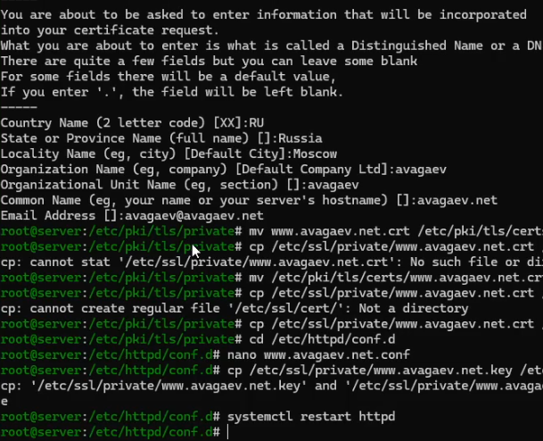
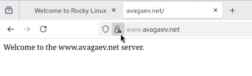
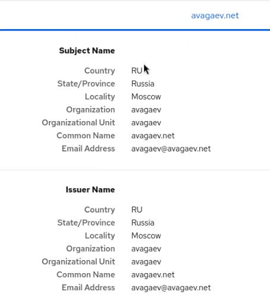
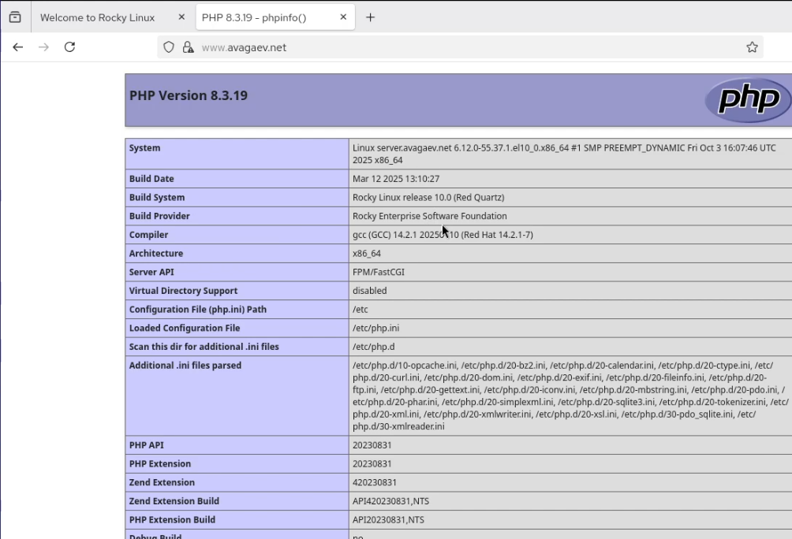

---
## Author
author:
  name: Арсений Валерьевич Агаев
  email: 1032221668@rudn.ru
  affiliation:
    - name: Российский университет дружбы народов
      country: Российская Федерация
      postal-code: 117198
      city: Москва
      address: ул. Миклухо-Маклая, д. 6

## Title
title: "Лабораторная работа №5"
subtitle: "Расширенная настройка HTTP-сервера Apache"
license: "CC BY"
---

# Цель работы

Приобрести практические навыки по расширенному конфигурированию 
HTTP-сервера Apache в части безопасности и возможности использования PHP.

# Задание

- Сгенеровать криптографический ключ и самоподписанный сертификат безопасности 
для возможности перехода веб-сервера от работы через протокол 
HTTP к работе через протокол HTTPS 

- Настройте веб-сервер для работы с PHP

- Скорректировать скрипт для Vagrant, фиксирующий действия по расширенной настройке HTTP-сервера.

# Выполнение лабораторной работы

## Конфигурирование HTTP-сервера для работы через протокол HTTPS

Создал необходимые каталоги и ключ с сертификатом:

```
mkdir -p /etc/pki/tls/private
ln -s /etc/pki/tls/private /etc/ssl/private
cd /etc/pki/tls/private

openssl req -x509 -nodes -newkey rsa:2048 -keyout www.avagaev.net.key \
    -out www.avagaev.net.crt
mv www.avagaev.net.crt /etc/pki/tls/certs
```

В параметрах сертификата указал:

- Russia

- Moscow

- avagaev

- avagaev

- avagaev.net

- avagaev@avagaev.net

Копирую полученный сертификат в ```/etc/ssl/certs```:

```
cp /etc/ssl/private/www.avagaev.net.crt /etc/ssl/cert/
```

После изменяют файл конфигурации ```/etc/httpd/conf.d/www.avagaev.net.conf```:

```conf
<VirtualHost *:80>
  ServerAdmin webmaster@avagaev.net
  DocumentRoot /var/www/html/www.avagaev.net
  ServerName www.avagaev.net
  ServerAlias www.avagaev.net
  ErrorLog logs/www.avagaev.net-error_log
  CustomLog logs/www.avagaev.net-access_log common
  RewriteEngine on
  RewriteRule ^(.*)$ https://%{HTTP_HOST}$1 [R=301,L]
</VirtualHost>

<IfModule mod_ssl.c>
<VirtualHost *:443>
  SSLEngine on
  ServerAdmin webmaster@avagaev.net
  DocumentRoot /var/www/html/www.avagaev.net
  ServerName www.avagaev.net
  ServerAlias www.avagaev.net
  ErrorLog logs/www.avagaev.net-error_log
  CustomLog logs/www.avagaev.net-access_log common
  SSLCertificateFile /etc/ssl/certs/www.avagaev.net.crt
  SSLCertificateKeyFile /etc/ssl/private/www.avagaev.net.key
</VirtualHost>
</IfModule>
```

Настроил firewalld для работы с https:

```
firewall-cmd --add-service=https
firewall-cmd --add-service=https --permanent
firewall-cmd --reload
```

Перезапустил службу:

```
systemctl restart httpd
```

{#fig-001 width=70%}

На ВМ ```client``` через браузер зашел на ```www.avagaev.net``` ([рис. @fig-002] и [рис. @fig-003]):

{#fig-002 width=70%}

{#fig-003 width=70%}

## Конфигурирование HTTP-сервера для работы с PHP

Установил PHP:

```
dnf -y install php
```

Отредактировал index файл в ```/var/www/html/www.avagaev.net```

```html
<?php
phpinfo();
?>
```

Скорректировал права доступа и контекст безопасности:

```
chown -R apache:apache /var/www
restorecon -vR /etc
restorecon -vR /var/www
```

Перезапустил сервер:

```
systemctl restart httpd
```

На ВМ ```client``` через браузер зашел на ```www.avagaev.net``` ([рис. @fig-004]):

{#fig-004 width=70%}

## Внесение изменений в настройки внутреннего окружения виртуальных машин

На ВМ ```server``` перешел в каталог для внесения изменений в настройки внутреннего окружения 
```/vagrant/provision/server``` и зафиксировал проведенную работу:

```
cd /vagrant/provision/server

cp -R /etc/httpd/conf.d/* /vagrant/provision/server/http/etc/httpd/conf.d
cp -R /var/www/html/* /vagrant/provision/server/http/var/www/html

mkdir -p /vagrant/provision/server/http/etc/pki/tls/private
mkdir -p /vagrant/provision/server/http/etc/pki/tls/certs

cp -R /etc/pki/tls/private/www.user.net.key \
    /vagrant/provision/server/http/etc/pki/tls/private
cp -R /etc/pki/tls/certs/www.user.net.crt \
    /vagrant/provision/server/http/etc/pki/tls/certs
```

В файл ```/vagrant/provision/server/http.sh``` внес изменения:

```sh
...
dnf -y install php
...
firewall-cmd --add-service=https
firewall-cmd --add-service=https --permanent
...
```

# Выводы

Я приобрёл практические навыки по расширенному конфигурированию 
HTTP-сервера Apache в части безопасности и возможности использования PHP.

