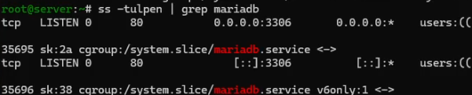
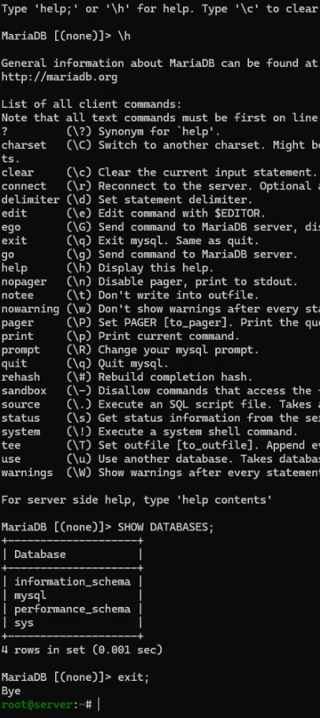
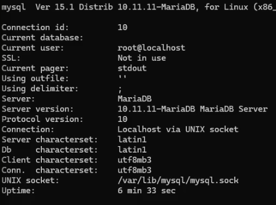
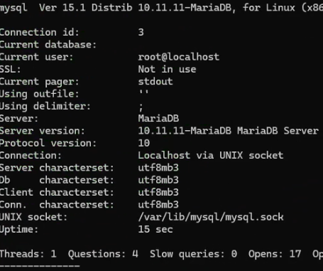
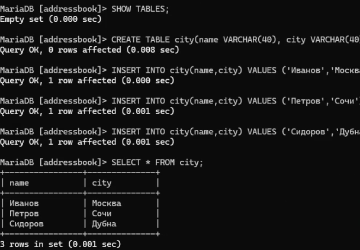
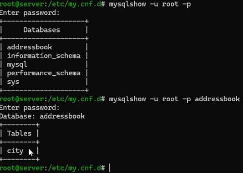
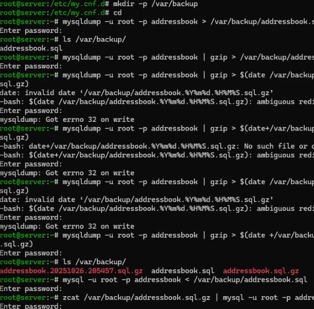

---
## Author
author:
  name: Арсений Валерьевич Агаев
  email: 1032221668@rudn.ru
  affiliation:
    - name: Российский университет дружбы народов
      country: Российская Федерация
      postal-code: 117198
      city: Москва
      address: ул. Миклухо-Маклая, д. 6

## Title
title: "Лабораторная работа №6"
subtitle: "Установка и настройка системы управления базами данных MariaDB"
license: "CC BY"
---

# Цель работы

Приобрести практические навыки по установке и конфигурированию 
системы управления базами данных на примере программного обеспечения MariaDB.

# Задание

- Установить необходимые для работы MariaDB пакеты

- Настройте в качестве кодировки символов по умолчанию utf8 в базах данных

- В базе данных MariaDB создать тестовую базу addressbook, содержащую таблицу 
city с полями name и city, т.е., например, для некоторого сотрудника указан город, 
в котором он работает 

- Создать резервную копию базы данных addressbook и восстановить из неё данные

- Написать скрипт для Vagrant, фиксирующий действия по установке и настройке 
базы данных MariaDB.

# Выполнение лабораторной работы

## Установка MariaDB

Установил необходимые пакеты:

```
dnf -y install mariadb mariadb-server
```

Запустил mariadb и убедился, что прослушивает порт ([рис. @fig-001]):

```
systemctl enable mariadb
systemctl start mariadb
ss -tulpen | grep mariadb
```

{#fig-001 width=70%}

Запустил скрипт конфигурации безопасности, где указал пароль root, отключил корневой 
доступ и удалил тестовую БД и анонимных пользователей:

```
mysql_secure_installation
```

После вошел в БД с правами администратора:

```
mysql -u root -p
```

Посмотрел список команд введя ```\h```.

Посмотрел список существующих БД:

```
SHOW DATABASES;
```

Уже существуют 4 технические базы данных.

Вышел из интерфейса интерактивной оболочки MariaDB:

```
exit;
```

{#fig-002 width=70%}

## Конфигурация кодировки символов

Вошел в БД с правами администратора:

```
mysql -u root -p
```

Отобразил статуса MariaDB ([рис. @fig-003]):

{#fig-003 width=70%}

На экран выводится:

- ID подключения

- Текущая БД

- Текущий пользователь

- Использование SSL

- Текущий вывод

- Используемый файл вывода

- Используемый символ-разделитель

- Сервер

- Версия сервера

- Версия протокола

- Соедиение

- Кодировка сервера

- Кодировка БД

- Кодировка клиента

- Кодировка подключения

- UNIX-сокет

- Время работы

В каталоге ```/etc/my.cnf.d``` создал файл ```utf8.cnf```:

```
cd /etc/my.cnf.d
touch utf8.cnf
```

В самом файле записал следующее:

```conf
[client]
default-character-set = utf8
[mysqld]
character-set-server = utf8
```

Перезапустил MariaDB и снова проверил статус ([рис. @fig-004]):

{#fig-004 width=70%}

Изменились кодировки сервера и БД.

## Создание базы данных

Вошел в БД с правами администратора:

```
mysql -u root -p
```

Создал БД ```addressbook``` и перешел к ней:

```sql
CREATE DATABASE addressbook CHARACTER SET utf8 COLLATE utf8_general_ci;

USE addressbook;
```

Отобразил имеющиеся таблицы в БД и создал свою таблицу ```city```:

```sql
SHOW TABLES;

CREATE TABLE city(name VARCHAR(40), city VARCHAR(40));
```

Заполнил данную таблицу некоторыми данными:

```sql
INSERT INTO city(name,city) VALUES ('Иванов','Москва');
INSERT INTO city(name,city) VALUES ('Петров','Сочи');
INSERT INTO city(name,city) VALUES ('Сидоров','Дубна');
```

После вывел данные в таблице:

```sql
SELECT * FROM city;
```

{#fig-005 width=70%}

Выводятся внесенные ранее данные.

После создал пользователя для работы с данной БД, предоставил ему права доступа 
и обновил привилегии БД:

```sql
CREATE USER avagaev@'%' IDENTIFIED BY 'strongpass';

GRANT SELECT,INSERT,UPDATE,DELETE ON addressbook.* TO avagaev@'%';

FLUSH PRIVILEGES;
```

Вывел общую информацию о таблицу ```city```:

```sql
DESCRIBE city;
```

{#fig-005 width=70%}

И вышел из окружения MariaDB:

```
quit
```

Посмотрел список баз данных и список таблиц в БД ```addressbook```:

```
mysqlshow -u root -p

mysqlshow -u root -p addressbook
```

{#fig-006 width=70%}

## Резервные копии

Создал каталог для резервных копий:

```
mkdir -p /var/backup
```

После сделал копию:

```
mysqldump -u root -p addressbook > /var/backup/addressbook.sql
```

Копию со сжатием:

```
mysqldump -u root -p addressbook | gzip > /var/backup/addressbook.sql.gz
```

Сжатую с датой:

```
mysqldump -u root -p addressbook | \
    gzip > $(date +/var/backup/addressbook.%Y%m%d.%H%M%S.sql.gz)
```

Затем восстановил БД из резервной копии:

```
mysql -u root -p addressbook < /var/backup/addressbook.sql
```

Восстановил из сжатой резервной копии:

```
zcat /var/backup/addressbook.sql.gz | mysql -u root -p addressbook
```

{#fig-007 width=70%}

## Внесение изменений в настройки внутреннего окружения виртуальных машин

На ВМ ```server``` перешел в каталог для внесения изменений в настройки внутреннего окружения 
```/vagrant/provision/server``` и зафиксировал проведенную работу:

```
cd /vagrant/provision/server

mkdir -p /vagrant/provision/server/mysql/etc/my.cnf.d
mkdir -p /vagrant/provision/server/mysql/var/backup

cp -R /etc/my.cnf.d/utf8.cnf \
    /vagrant/provision/server/mysql/etc/my.cnf.d/
cp -R /var/backup/* /vagrant/provision/server/mysql/var/backup/

touch mysql.sh
chmod +x mysql.sh
```

В файл ```/vagrant/provision/server/mysql.sh``` записал скрипт:

```sh
#!/bin/bash

echo "Provisioning script $0"

echo "Install needed packages"
dnf -y install mariadb mariadb-server

echo "Copy configuration files"
cp -R /vagrant/provision/server/mysql/etc/* /etc
mkdir -p /var/backup
cp -R /vagrant/provision/server/mysql/var/backup/* /var/backup

echo "Start mysql service"
systemctl enable mariadb
systemctl start mariadb

if [[ ! -d /var/lib/mysql/mysql ]]
then
echo "Securing mariadb"
mysql_secure_installation <<EOF

y
123456
123456
y
y
y
y
EOF

echo "Create database"
mysql -u root -p123456 <<EOF
CREATE DATABASE addressbook CHARACTER SET utf8 COLLATE utf8_general_ci;
EOF
mysql -u root -p123456 addressbook < /var/backup/addressbook.sql

fi
```

Для отработки данных скриптов, внес изменения в Vagrantfile в соответсвующую секцию:

```conf
server.vm.provision "server mysql",
   type: "shell",
   preserve_order: true,
   path: "provision/server/mysql.sh"
```

# Выводы

Я приобрёл практические навыки по установке и конфигурированию 
системы управления базами данных на примере программного обеспечения MariaDB.

