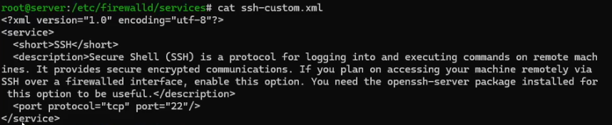
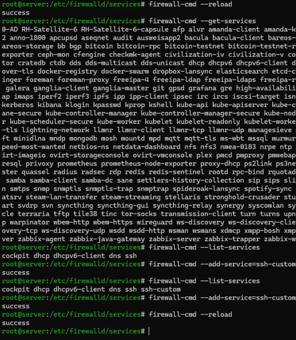
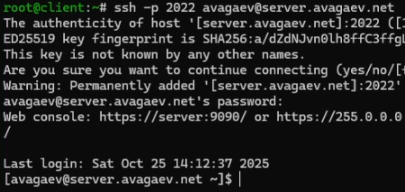
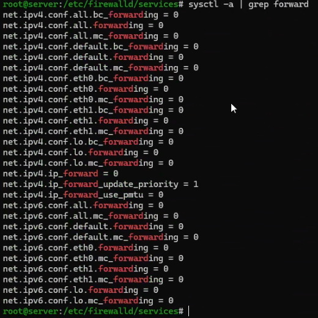

---
## Author
author:
  name: Арсений Валерьевич Агаев
  email: 1032221668@rudn.ru
  affiliation:
    - name: Российский университет дружбы народов
      country: Российская Федерация
      postal-code: 117198
      city: Москва
      address: ул. Миклухо-Маклая, д. 6

## Title
title: "Лабораторная работа №7"
subtitle: "Расширенные настройки межсетевого экрана"
license: "CC BY"
---

# Цель работы

Получить навыки настройки межсетевого экрана в Linux в части переадресации портов 
и настройки Masquerading.

# Задание

- Настроить межсетевой экран ВМ ```server```` для доступа к 
серверу по протоколу SSH не через 22-й порт, а через порт 2022

- Настроить Port Forwarding на ВМ ```server```

- Настроить маскарадинг на ВМ ```server``` для организации доступа клиента к сети Интернет

- Написать скрипт для Vagrant, фиксирующий действия по расширенной настройке межсетевого экрана

# Выполнение лабораторной работы

## Создание пользовательской службы firewalld

На основе существующего файла описания службы ```ssh``` создал собственный:

```
cp /usr/lib/firewalld/services/ssh.xml \  
   /etc/firewalld/services/ssh-custom.xml
```

После посмотрел его содержимое ([рис. @fig-001]):

```
cat /etc/firewalld/services/ssh-custom.xml
```

{#fig-001 width=70%}

В нем в формате XML описан сервис:

- Наименование

- Описание

- Перечисление необходимых портов (в данном случае)

Изменил 22 порт на 2022 в данном файле и перезагрузил firewalld:

```
firewall-cmd --reload
firewall-cmd --get-services
firewall-cmd --list-services
```

При этом видно, что он есть в сервисах, но еще не активный. Добавил свою службу и снова 
перезапустил firewalld:

```
firewall-cmd --add-service=ssh-custom
firewall-cmd --add-service=ssh-custom --permanent
firewall-cmd --reload
```

{#fig-002 width=70%}

## Перенаправление портов

Организовал на сервере переадресацию с 2022 на 22 порт:

```
firewall-cmd --add-forward-port=port=2022:proto=tcp:toport=22
```

На клиенте попробовал получить доступ через 2022 порт:

```
ssh -p 2022 avagaev@server.avagaev.net
```

{#fig-003 width=70%}

## Настройка Port Forwarding и Masquerading

Проверил, активировано ли в ОС возможность перенаправления IPv4 пакетов:

```
sysctl -a | grep forward
```

{#fig-004 width=70%}

После включил:

```
echo "net.ipv4.ip_forward = 1" > /etc/sysctl.d/90-forward.conf
sysctl -p /etc/sysctl.d/90-forward.conf
```

Также включил маскарадинг в firewalld:

```
firewall-cmd --zone=public --add-masquerade --permanent
firewall-cmd --reload
```

{#fig-005 width=70%}

## Внесение изменений в настройки внутреннего окружения виртуальных машин

На ВМ ```server``` перешел в каталог для внесения изменений в настройки внутреннего окружения 
```/vagrant/provision/server``` и зафиксировал проведенную работу:

```
cd /vagrant/provision/server

mkdir -p /vagrant/provision/server/firewall/etc/firewalld/services
mkdir -p /vagrant/provision/server/firewall/etc/sysctl.d

cp -r /etc/firewalld/services/ssh-custom.xml \
    /vagrant/provision/server/firewall/etc/firewalld/services/
cp -r /etc/sysctl.d/90-forward.conf \
    /vagrant/provision/server/firewall/etc/sysctl.d/

touch firewall.sh
chmod +x firewall.sh
```

В файл ```/vagrant/provision/server/firewall.sh``` записал скрипт:

```sh
#!/bin/bash

echo "Provisioning script $0"

echo "Copy configuration files"
cp -R /vagrant/provision/server/firewall/etc/* /etc

echo "Configure masquerading"
firewall-cmd --add-service=ssh-custom --permanent
firewall-cmd --add-forward-port=port=2022:proto=tcp:toport=22 --permanent
firewall-cmd --zone=public --add-masquerade --permanent
firewall-cmd --reload

restorecon -vR /etc
```

Для отработки данных скриптов, внес изменения в Vagrantfile в соответсвующую секцию:

```conf
server.vm.provision "server firewall",
   type: "shell",
   preserve_order: true,
   path: "provision/server/firewall.sh"
```

# Выводы

Я получил навыки настройки межсетевого экрана в Linux в части переадресации портов 
и настройки Masquerading.

