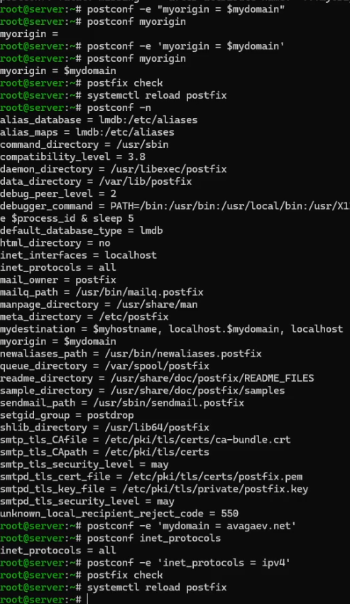
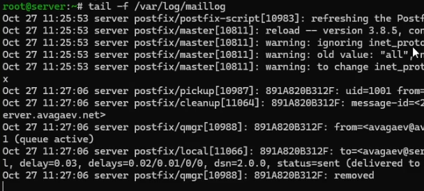
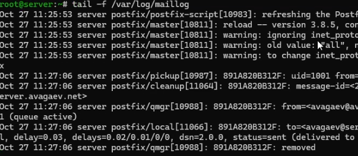
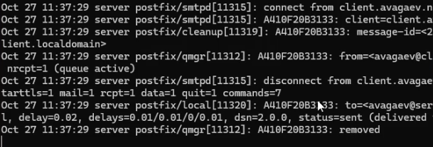
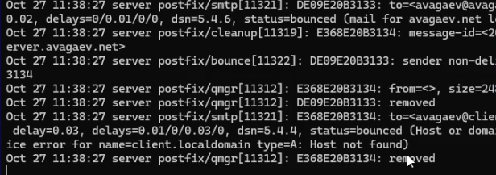
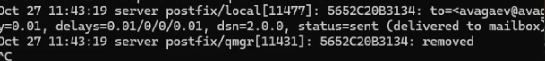

---
## Author
author:
  name: Арсений Валерьевич Агаев
  email: 1032221668@rudn.ru
  affiliation:
    - name: Российский университет дружбы народов
      country: Российская Федерация
      postal-code: 117198
      city: Москва
      address: ул. Миклухо-Маклая, д. 6

## Title
title: "Лабораторная работа №8"
subtitle: "Настройка SMTP-сервера"
license: "CC BY"
---

# Цель работы

Приобрести практические навыки по установке и конфигурированию SMTP-сервера.

# Задание

- Установить на ВМ ```server``` SMTP-сервер postfix

- Сделать первоначальную настройку postfix при помощи утилиты postconf

- Проверить отправку почты с сервера и клиента

- Сконфигурировать Postfix для работы в домене. Проверить отправку почты

- Написать скрипт для Vagrant, фиксирующий действия по установке и настройке Postfix

# Выполнение лабораторной работы

## Установка Postfix

Установил необходимые пакеты, добавил службу SMTP в firewalld, восстановил контекст 
безопасности SELinux и запустил Postfix:

```
dnf -y install postfix
dnf -y install s-nail

firewall-cmd --add-service=smtp
firewall-cmd --add-service=smtp --permanent
firewall-cmd --reload

restorecon -vR /etc

systemctl enable postfix
systemctl start postfix
```

## Изменение параметров Postfix с помощью postconf

Посмотрел список текущих настроек Postfix:

```
postconf
```

Также текущие значения ```myorigin``` и ```mydomain```:

```
postconf myorigin

postconf mydomain
```

После заменил значение ```myorigin``` и проверил изменение и корректность конфигурации:

```
postconf -e ‘myorigin = $mydomain’

postconf myorigin

postfix check
```

Перезагрузил Postfix и вывел значения, отличные от значения по умолчанию:

```
postconf -n
```

После жёстко задал значение домена, отключил IPv6 и снова перезагрузил Postfix:

```
postconf -e 'mydomain = avagaev.net'

postconf -e 'inet_protocols = ipv4'

postfix check
systemctl reload postfix
```

{#fig-001 width=70%}

## Проверка работы Postfix

Попытался отправить себе письмо под своей учётной записью на сервере:

```
echo .| mail -s test1 avagaev@server.avagaev.net
```

В дополнительном терминате запустил мониторинг работы почтовой службы и посмотрел, что 
произошло с отправленным сообщением:

```
tail -f /var/log/maillog
```

{#fig-002 width=70%}

Письмо было доставлено и после удалено.

На ВМ ```client``` также установил необходимые пакеты:

```
dnf -y install postfix
dnf -y install s-nail
```

Отключил IPv6 и запустил Postfix. Следом отправил письмо с этой ВМ:

```
postconf -e 'inet_protocols = ipv4'

systemctl enable postfix
systemctl start postfix

echo .| mail -s test1 avagaev@server.avagaev.net
```

{#fig-003 width=70%}

Сообщение не было доставлено, новых записей не появилось.

Поэтому, на сервере изменил значения ```inet_interfaces``` и ```mynetworks``` и перезагрузил Postfix:

```
postconf -e 'inet_interfaces = all'

postconf -e 'mynetworks = 127.0.0.0/8, 192.168.0.0/16'

postfix check
systemctl reload postfix
```

После повторил отправку почты с клиента.

{#fig-004 width=70%}

## Конфигурация Postfix для домена

Попробовал отправить письмо на свой доменный адрес:

```
echo .| mail -s test2 avagaev@avgaev.net
```

{#fig-005 width=70%}

Из сообщения видно, что домен не был разрешен.

Чтобы это решить, добавил MX-запись в файле прямой DNS-зоны:

```conf
...
	A	192.168.1.1
	MX 10   mail.avagaev.net.
$ORIGIN avagaev.net.
server  A	192.168.1.1
ns 	A 	192.168.1.1
dhcp 	A 	192.168.1.1
www 	A 	192.168.1.1
mail 	A 	192.168.1.1
```

И в файле обратной DNS-зоны:

```conf
...
	PTR	server.avagaev.net.
	MX 10 	mail.avagaev.net.
$ORIGIN 1.168.192.in-addr.arpa.
1	PTR 	server.avagaev.net.
1 	PTR 	ns.avagaev.net.
1 	PTR 	dhcp.avagaev.net.
1 	PTR 	www.avagaev.net.
1 	PTR 	mail.avagaev.net.
```

В конфигурацию Postfix добавил домен в список элементов сети:

```
postconf -e 'mydestination = $myhostname,localhost.$mydomain,localhost,$mydomain
```

Перезапустил конфигурацию Postfix, восстановил контекст безопасности SELinux, перезапустил DNS:

```
postfix check
systemctl reload postfix

restorecon -vR /etc
restorecon -vR /var/named

systemctl restart named
```

Попробовал отправить сообщение внонь.

{#fig-006 width=70%}

## Внесение изменений в настройки внутреннего окружения виртуальных машин

На ВМ ```server``` перешел в каталог для внесения изменений в настройки внутреннего окружения 
```/vagrant/provision/server``` и зафиксировал проведенную работу:

```
cd /vagrant/provision/server

cp -R /var/named/* /vagrant/provision/server/dns/var/named

touch mail.sh
chmod +x mail.sh
```

В файл ```/vagrant/provision/server/mail.sh``` записал скрипт:

```sh
#!/bin/bash

echo "Provisioning script $0"

echo "Install needed packages"
dnf -y install postfix
dnf -y install s-nail

echo "Copy configuration files"
cp -R /vagrant/provision/server/mail/etc/* /etc

echo "Configure firewall"
firewall-cmd --add-service=smtp --permanent
firewall-cmd --reload

restorecon -vR /etc

echo "Start postfix service"
systemctl enable postfix
systemctl start postfix

echo "Configure postfix"
postconf -e 'mydomain = avagaev.net'
postconf -e 'myorigin = $mydomain'
postconf -e 'inet_protocols = ipv4'
postconf -e 'inet_interfaces = all'
postconf -e 'mydestination = $myhostname,localhost.$mydomain,localhost,$mydomain'
postconf -e 'mynetworks = 127.0.0.0/8, 192.168.0.0/16'

postfix set-permissions

restorecon -vR /etc

systemctl stop postfix
systemctl start postfix
```

Аналогично для ВМ ```client```:

```
cd /vagrant/provision/client

touch mail.sh
chmod +x mail.sh
```

В файл ```/vagrant/provision/client/mail.sh``` записал скрипт:

```sh
#!/bin/bash

echo "Provisioning script $0"

echo "Install needed packages"
dnf -y install postfix
dnf -y install s-nail

echo "Configure postfix"
postconf -e 'inet_protocols = ipv4'

echo "Start postfix service"
systemctl enable postfix
systemctl start postfix
```

Для отработки данных скриптов, внес изменения в Vagrantfile в соответсвующую секцию:

```conf
server.vm.provision "server mail",
   type: "shell",
   preserve_order: true,
   path: "provision/server/mail.sh"
...
server.vm.provision "client mail",
   type: "shell",
   preserve_order: true,
   path: "provision/client/mail.sh"
```

# Выводы

Я приобрёл практические навыки по установке и конфигурированию SMTP-сервера.

