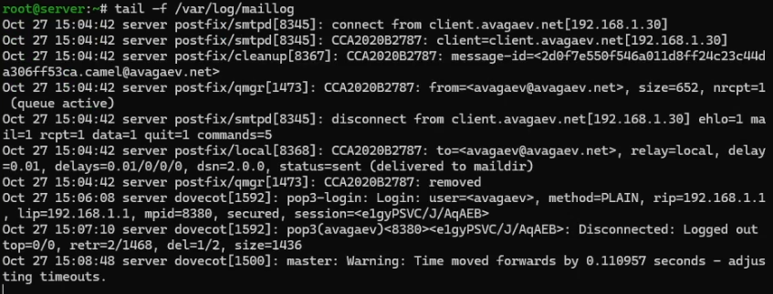
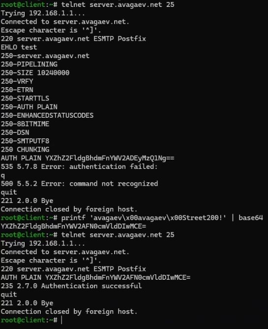

---
## Author
author:
  name: Арсений Валерьевич Агаев
  email: 1032221668@rudn.ru
  affiliation:
    - name: Российский университет дружбы народов
      country: Российская Федерация
      postal-code: 117198
      city: Москва
      address: ул. Миклухо-Маклая, д. 6
## Title
title: Лабораторная работа №10
subtitle: Расширенные настройки SMTP-сервера
license: CC BY
date: today
date-format: "YYYY-MM-DD" # Example: 2025-09-06
---

# Информация

## Докладчик

:::::::::::::: {.columns align=center}
::: {.column width="70%"}

  * Арсений Валерьевич Агаев
  * студент
  * Российский университет дружбы народов им. П. Лумумбы
  * [1032221668@rudn.ru](mailto:1032221668@rudn.ru)

:::
::: {.column width="30%"}

:::
::::::::::::::


# Цели и задачи

Приобретение практических навыков по конфигурированию SMTP-сервера в части
настройки аутентификации.

- Настройка Dovecot для работы с LMTP.

- Настройка аутентификации посредством SASL на SMTP-сервере.

- Настройка работы SMTP-сервера поверх TLS.

- Скорректировать скрипт для Vagrant, фиксирующий проделанные действия.

# Содержание исследования

## Настройка LMTP в Dovecot

{#fig-001 width=70%}

## Настройка LMTP в Dovecot

После в файле ```/etc/dovecot/dovecot.conf``` добавляю протокол LMTP:

```conf
protocols = imap pop3 lmtp
```

В файле ```/etc/dovecot/conf.d/10-master.conf``` переопределяю сервис lmtp:

```conf
service lmtp {
  unix_listener /var/spool/postfix/private/dovecot-lmtp {
    group = postfix
    user = postfix
    mode = 0600
  }
}
```

## Настройка LMTP в Dovecot

В Postfix переопределяю передачу сообщений через данный unix-сокет:

```
postconf -e 'mailbox_transport = lmtp:unix:private/dovecot-lmtp'
```

В файле ```/etc/dovecot/conf.d/10-auth.conf``` задаю формат имени пользователя:

```conf
auth_username_format = %Ln
```

## Настройка LMTP в Dovecot

{#fig-002 width=70%}

## Настройка SMTP-аутентификации

В файле ```/etc/dovecot/conf.d/10-master.conf``` определил службу аутентификации пользователей:

```conf
service auth {
  unix_listener /var/spool/postfix/private/auth {
    group = postfix
    user = postfix
    mode = 0660
  }
  unix_listener auth-userdb {
    mode = 0600
    user = dovecot
  }
}
```
## Настройка SMTP-аутентификации

Для Postfix задал тип аутентификации SASL для smtpd и соответствующий unix-сокет:

```
postconf -e 'smtpd_sasl_type = dovecot'
postconf -e 'smtpd_sasl_path = private/auth'
```

Настроил Postfix для приёма почты из Интернета только для пользователей сервера или для
произвольных пользователей локальной машины:

```
postconf -e 'smtpd_recipient_restrictions = \
    reject_unknown_recipient_domain, permit_mynetworks, \
    reject_non_fqdn_recipient, reject_unauth_destination, \
    reject_unverified_recipient, permit'
```

Ограничил приём почты только локальным адресом SMTP-сервера сети:

```
postconf -e 'mynetworks = 127.0.0.0/8'
```

## Настройка SMTP-аутентификации

Запустил SMTP-сервер с возможностью аутентификации.
Для этого внес изменения в файл ```/etc/postfix/master.cf```:

```conf
smtp inet n - n - - smtpd
  -o smtpd_sasl_auth_enable=yes
  -o smtpd_recipient_restrictions=reject_non_fqdn_recipient, \
  reject_unknown_recipient_domain,permit_sasl_authenticated,reject
```

## Настройка SMTP-аутентификации

{#fig-003 width=70%}

## Проверка SMTP-аутентификации

{#fig-004 width=70%}

## Настройка SMTP over TLS

Настроил на сервере TLS, скопировав файлы сертификата и ключа Dovecot:

```
cp /etc/pki/dovecot/certs/dovecot.pem /etc/pki/tls/certs
cp /etc/pki/dovecot/private/dovecot.pem /etc/pki/tls/private
```

И сконфигурировав Postfix:

```
postconf -e 'smtpd_tls_cert_file=/etc/pki/tls/certs/dovecot.pem'
postconf -e 'smtpd_tls_key_file=/etc/pki/tls/private/dovecot.pem'
postconf -e 'smtpd_tls_session_cache_database = \
btree:/var/lib/postfix/smtpd_scache'
postconf -e 'smtpd_tls_security_level = may'
postconf -e 'smtp_tls_security_level = may'
```

## Настройка SMTP over TLS

Вновь изменил запись в ```/etc/postfix/master.cf```:

```conf
smtp inet n - n - - smtpd
  -o smtpd_tls_security_level=encrypt
  -o smtpd_sasl_auth_enable=yes
  -o smtpd_recipient_restrictions=reject_non_fqdn_recipient, \
  reject_unknown_recipient_domain,permit_sasl_authenticated,reject
```

Добавил ```smtp-submission``` в firewalld:

```
firewall-cmd --add-service=smtp-submission
firewall-cmd --add-service=smtp-submission --permanent
firewall-cmd --reload
```

{#fig-005 width=70%}

## Фиксация изменений в настройках внутреннего окружения виртуальной машины

Проделываю данные манипуляции в каталоге ```/vagrant/provision/server```

```
cp -R /etc/dovecot/dovecot.conf /vagrant/provision/server/mail/etc/dovecot/
cp -R /etc/dovecot/conf.d/10-master.conf /vagrant/provision/server/mail/etc/dovecot/conf.d/
cp -R /etc/dovecot/conf.d/10-auth.conf /vagrant/provision/server/mail/etc/dovecot/conf.d/
mkdir -p /vagrant/provision/server/mail/etc/postfix/
cp -R /etc/postfix/master.cf /vagrant/provision/server/mail/etc/postfix/
```

## Фиксация изменений в настройках внутреннего окружения виртуальной машины

Внес изменения в файл ```/vagrant/provision/server/mail.sh```.
Добавил:

```
...
echo "Configure postfix for auth"
postconf -e 'smtpd_sasl_type = dovecot'
postconf -e 'smtpd_sasl_path = private/auth'
postconf -e 'smtpd_recipient_restrictions = 
reject_unknown_recipient_domain, permit_mynetworks, 
reject_non_fqdn_recipient, reject_unauth_destination, 
reject_unverified_recipient, permit'
...
echo "Configure postfix for SMTP over TLS"
cp /etc/pki/dovecot/certs/dovecot.pem /etc/pki/tls/certs
cp /etc/pki/dovecot/private/dovecot.pem /etc/pki/tls/private
postconf -e 'smtpd_tls_cert_file=/etc/pki/tls/certs/dovecot.pem'
postconf -e 'smtpd_tls_key_file=/etc/pki/tls/private/dovecot.pem'
postconf -e 'smtpd_tls_session_cache_database = 
btree:/var/lib/postfix/smtpd_scache'
postconf -e 'smtpd_tls_security_level = may'
postconf -e 'smtp_tls_security_level = may'
...
```

# Результаты

Я успешно приобрел практические навыки по конфигурированию SMTP-сервера в части
настройки аутентификации.
