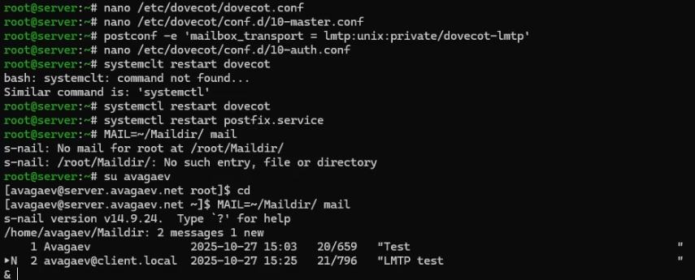
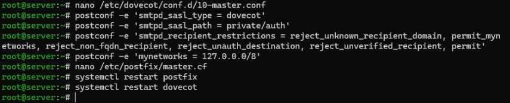
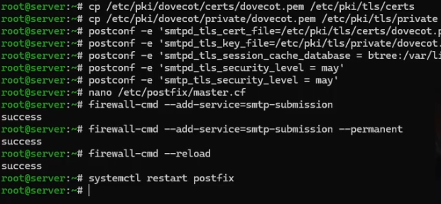

---
## Author
author:
  name: Арсений Валерьевич Агаев
  email: 1032221668@rudn.ru
  affiliation:
    - name: Российский университет дружбы народов
      country: Российская Федерация
      postal-code: 117198
      city: Москва
      address: ул. Миклухо-Маклая, д. 6

## Title
title: "Лабораторная работа №10"
subtitle: "Расширенные настройки SMTP-сервера"
license: "CC BY"
---

# Цель работы

Приобретение практических навыков по конфигурированию SMTP-сервера в части
настройки аутентификации.

# Задание

- Настройка Dovecot для работы с LMTP.

- Настройка аутентификации посредством SASL на SMTP-сервере.

- Настройка работы SMTP-сервера поверх TLS.

- Скорректировать скрипт для Vagrant, фиксирующий действия расширенной настройки SMTP-сервера 
во внутреннем окружении виртуальной машины ```server```.

# Выполнение лабораторной работы

## Настройка LMTP в Dovecot

Для начала я в дополнительном окне запускаю мониторинг работы почтовой службы ([рис. @fig-001]).

```
tail -f /var/log/maillog
```

{#fig-001 width=70%}

После в файле ```/etc/dovecot/dovecot.conf``` добавляю протокол LMTP:

```conf
protocols = imap pop3 lmtp
```

В файле ```/etc/dovecot/conf.d/10-master.conf``` переопределяю сервис lmtp:

```conf
service lmtp {
  unix_listener /var/spool/postfix/private/dovecot-lmtp {
    group = postfix
    user = postfix
    mode = 0600
  }
}
```

В Postfix переопределяю передачу сообщений через данный unix-сокет:

```
postconf -e 'mailbox_transport = lmtp:unix:private/dovecot-lmtp'
```

В файле ```/etc/dovecot/conf.d/10-auth.conf``` задаю формат имени пользователя:

```conf
auth_username_format = %Ln
```

После перезапускаю сервисы:

```
systemctl restart postfix
systemctl restart dovecot
```

Под учетной записью пользователя отправляю письмо:

```
echo .| mail -s "LMTP test" avagaev@avagaev.net
```

И проверяю его наличие в почтовом ящике пользователя:

```
MAIL=~/Mailddir/ mail
```

{#fig-002 width=70%}

## Настройка SMTP-аутентификации

В файле ```/etc/dovecot/conf.d/10-master.conf``` определил службу аутентификации пользователей:

```conf
service auth {
  unix_listener /var/spool/postfix/private/auth {
    group = postfix
    user = postfix
    mode = 0660
  }
  unix_listener auth-userdb {
    mode = 0600
    user = dovecot
  }
}
```

В нем:

- ```service auth {``` блок сервиса аутентификации dovecot.

- ```unix_listener /var/spool/postfix/private/auth {``` создаём UNIX сокет для postfix и помещаем его внутрь postfix chroot. Без этого postfix не сможет узнать у dovecot кто это "user"?

- ```group = postfix``` сокет принадлежит группе postfix, он сможет читать/писать сокет.

- ```user = postfix``` сокет принадлежит пользователю postfix

- ```mode = 0660``` права: rw для owner + rw для group / другие полностью запрещены

- ```unix_listener auth-userdb {``` второй UNIX сокет. Это уже внутренний сокет только для dovecot процессов / internal dovecot auth.

- ``` mode = 0600``` только owner может читать/писать.

- ```user = dovecot``` его владелец dovecot. Изолировано от postfix.

Для Postfix задал тип аутентификации SASL для smtpd и соответствующий unix-сокет:

```
postconf -e 'smtpd_sasl_type = dovecot'
postconf -e 'smtpd_sasl_path = private/auth'
```

Настроил Postfix для приёма почты из Интернета только для пользователей сервера или для
произвольных пользователей локальной машины:

```
postconf -e 'smtpd_recipient_restrictions = \
    reject_unknown_recipient_domain, permit_mynetworks, \
    reject_non_fqdn_recipient, reject_unauth_destination, \
    reject_unverified_recipient, permit'
```

Здесь задаются:

- ```reject_unknown_recipient_domain``` если домен получателя не существует в DNS -> reject.

- ```permit_mynetworks``` локальные хосты (localhost, trusted сегменты LAN) -> всегда разрешены.

- ```reject_non_fqdn_recipient``` если получатель не в форме нормального FQDN e.g. user@domain -> reject.

- ```reject_unauth_destination``` запрещает принимать письма не для доменов сервера / если отправитель не авторизован.

- ```reject_unverified_recipient``` postfix делает реальную проверку существования получателя через dovecot auth.

- ```permit``` всё, что осталось -> разрешено.

Ограничил приём почты только локальным адресом SMTP-сервера сети:

```
postconf -e 'mynetworks = 127.0.0.0/8'
```

Для проверки работы аутентификации запустил SMTP-сервер с возможностью аутентификации.
Для этого внес изменения в файл ```/etc/postfix/master.cf```:

```conf
smtp inet n - n - - smtpd
  -o smtpd_sasl_auth_enable=yes
  -o smtpd_recipient_restrictions=reject_non_fqdn_recipient, \
  reject_unknown_recipient_domain,permit_sasl_authenticated,reject
```

После - перезапустил сервисы:

```
systemctl restart postfix
systemctl restart dovecot
```

{#fig-003 width=70%}

Далее на ВМ ```client``` я установил telnet:

```
sudo -i
dnf -y install telnet
```

Получил строку аутентификации:

```
printf 'avagaev\x00avagaev\x00Street200!' | base64
```

И проверил на подключение к SMTP посредством telnet:

```
telnet server.avagaev.net 25
EHLO test
```

Проверил авторизацию:

```
AUTH PLAIN YXZhZ2FldgBhdmFnYWV2AFN0cmVLdDIwMCE=
```
{#fig-004 width=70%}

## Настройка SMTP over TLS

Настроил на сервере TLS, скопировав файлы сертификата и ключа Dovecot:

```
cp /etc/pki/dovecot/certs/dovecot.pem /etc/pki/tls/certs
cp /etc/pki/dovecot/private/dovecot.pem /etc/pki/tls/private
```

И сконфигурировав Postfix:

```
postconf -e 'smtpd_tls_cert_file=/etc/pki/tls/certs/dovecot.pem'
postconf -e 'smtpd_tls_key_file=/etc/pki/tls/private/dovecot.pem'
postconf -e 'smtpd_tls_session_cache_database = \
btree:/var/lib/postfix/smtpd_scache'
postconf -e 'smtpd_tls_security_level = may'
postconf -e 'smtp_tls_security_level = may'
```

Вновь изменил запись в ```/etc/postfix/master.cf```:

```conf
smtp inet n - n - - smtpd
  -o smtpd_tls_security_level=encrypt
  -o smtpd_sasl_auth_enable=yes
  -o smtpd_recipient_restrictions=reject_non_fqdn_recipient, \
  reject_unknown_recipient_domain,permit_sasl_authenticated,reject
```

Добавил ```smtp-submission``` в firewalld:

```
firewall-cmd --add-service=smtp-submission
firewall-cmd --add-service=smtp-submission --permanent
firewall-cmd --reload
```

Перезапустил Postfix:

```
systemctp restart postfix
```

{#fig-005 width=70%}

## Внесение изменений в настройки внутреннего окружения виртуальной машины

Для внесения изменений в настройку внутреннего окружения ВМ ```server``` я поместил обновленные 
конфигурационные файлы Dovecpt и Postfix в соответствующие каталоги:

```
cp -R /etc/dovecot/dovecot.conf \
/vagrant/provision/server/mail/etc/dovecot/

cp -R /etc/dovecot/conf.d/10-master.conf \
/vagrant/provision/server/mail/etc/dovecot/conf.d/

cp -R /etc/dovecot/conf.d/10-auth.conf \
/vagrant/provision/server/mail/etc/dovecot/conf.d/

mkdir -p /vagrant/provision/server/mail/etc/postfix/
cp -R /etc/postfix/master.cf /vagrant/provision/server/mail/etc/postfix/
```

После внес изменения в файл ```/vagrant/provision/server/mail.sh```:

```sh
#!/bin/bash

echo "Provisioning script $0"

echo "Install needed packages"
dnf -y install postfix
dnf -y install s-nail
dnf -y install dovecot
dnf -y install telnet

echo "Copy configuration files"
cp -R /vagrant/provision/server/mail/etc/* /etc

chown -R root:root /etc/postfix
restorecon -vR /etc

echo "Configure firewall"
firewall-cmd --add-service=smtp --permanent
firewall-cmd --add-service=pop3 --permanent
firewall-cmd --add-service=pop3s --permanent
firewall-cmd --add-service=imap --permanent
firewall-cmd --add-service=imaps --permanent
firewall-cmd --reload

restorecon -vR /etc

echo "Start postfix service"
systemctl enable postfix
systemctl start postfix

echo "Configure postfix"
postconf -e 'mydomain = avagaev.net'
postconf -e 'myorigin = $mydomain'
postconf -e 'inet_protocols = ipv4'
postconf -e 'inet_interfaces = all'
postconf -e 'mydestination = $myhostname, 
localhost.$mydomain, localhost, $mydomain'
postconf -e 'mynetworks = 127.0.0.0/8, 192.168.0.0/16'
postconf -e 'home_mailbox = Maildir/'

echo "Configure postfix for auth"
postconf -e 'smtpd_sasl_type = dovecot'
postconf -e 'smtpd_sasl_path = private/auth'
postconf -e 'smtpd_recipient_restrictions = 
reject_unknown_recipient_domain, permit_mynetworks, 
reject_non_fqdn_recipient, reject_unauth_destination, 
reject_unverified_recipient, permit'

echo "Configure postfix for SMTP over TLS"
cp /etc/pki/dovecot/certs/dovecot.pem /etc/pki/tls/certs
cp /etc/pki/dovecot/private/dovecot.pem /etc/pki/tls/private
postconf -e 'smtpd_tls_cert_file=/etc/pki/tls/certs/dovecot.pem'
postconf -e 'smtpd_tls_key_file=/etc/pki/tls/private/dovecot.pem'
postconf -e 'smtpd_tls_session_cache_database = 
btree:/var/lib/postfix/smtpd_scache'
postconf -e 'smtpd_tls_security_level = may'
postconf -e 'smtp_tls_security_level = may'

postfix set-permissions

restorecon -vR /etc

systemctl stop postfix
systemctl start postfix
systemctl enable dovecot
systemctl start dovecot
```

# Выводы

Я приобрел практические навыки по конфигурированию SMTP-сервера в части
настройки аутентификации.
