---
## Author
author:
  name: Арсений Валерьевич Агаев
  email: 1032221668@rudn.ru
  affiliation:
    - name: Российский университет дружбы народов
      country: Российская Федерация
      postal-code: 117198
      city: Москва
      address: ул. Миклухо-Маклая, д. 6

## Title
title: "Лабораторная работа №11"
subtitle: "Настройки безопасного удаленного доступа по протоколу SSH"
license: "CC BY"
---

# Цель работы

Приобретение практических навыков по настройке удалённого доступа к серверу с помощью SSH.

# Задание

- Настроить запрет удалённого доступа на сервер по SSH для пользователя ```root```.

- Настроить разрешение удалённого доступа к серверу по SSH только для пользователей группы ```vargant``` и вашего пользователя.

- Настроить удалённый доступ к серверу по SSH через порт 2022.

- Настроить SSH-тунель с клиента на сервер, перенаправив локальное соединение с TCP-порта 80 на порт 8080.

- Используя удалённое SSH-соединение, выполнить с клиента несколько команд на сервере.

- Используя удалённое SSH-соединение, запустить с клиента графическое приложение на сервере.

- Написать скрипт для Vagrant, фиксирующий действия по настройке SSH-сервера во внутреннем окружении виртуальной машины ```server```. Соответствующим образом внести изменения в ```Vagrantfile```.

# Выполнение лабораторной работы

## Запрет удалённого доступа по SSH для пользователя root

В дополнительном терминале запустил мониторинг системных событий:

```
journalctl -x -f
```

Попытался войти на сервер под пользователем ```root``` посредством SSH-соединения ([рис. @fig-001]):

```
ssh root@server.avagaev.net
```

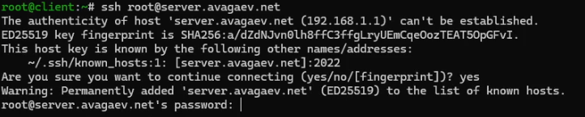{#fig-001 width=70%}

Так как это первая попытка подключиться к серверу, запить о его отпечатоке 
не была найдена в файле ```~/.ssh/known_hosts``` и пользователю предлагается добавить запись 
о сервере. При последующих попытках подключиться, он будет сверять ее с записью, чтобы предотвратить 
MITM (man in the middle) атаку. После видно, что подключение под пользователем ```root``` прошло успешно.

Внес изменения в конфигурацию ```/etc/ssh/sshd_config```, запретив доступ к пользователю ```root```:

```conf
PermitRootLogin no
```

И перезапустил sshd:

```
systemctl restart sshd
```

Снова попытался войти на сервер под пользователем ```root``` посредством SSH-соединения ([рис. @fig-002]): 

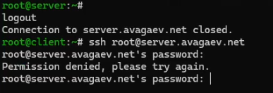{#fig-002 width=70%}

Теперь предлагается ввести пароль, но любой набор символов, включая верный, будет отброшен как ошибочный и подключиться не получится.

## Ограничение списка пользователей для удалённого доступа по SSH

Попытался войти на сервер под своим пользователем ```avagaev``` посредством 
SSH-соединения ([рис. @fig-003]):

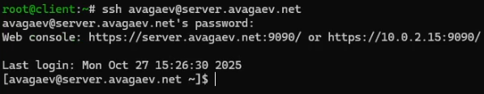{#fig-003 width=70%}

В этом случае происходит успешный вход в систему.

После я внес изменения в конфигурацию ```/etc/ssh/sshd_config``` и разрешил доступ только для
пользователя  vagrant:

```conf
AllowUsers vagrant
```

И снова перезапустил службу:

```
systemctl restart sshd
```

Вновь попытался войти на сервер под своим пользователем ```avagaev``` посредством 
SSH-соединения ([рис. @fig-004]):

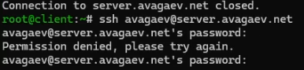{#fig-004 width=70%}

Как и в случае с ```root```, теперь попытки входа отбрасываются всегда, независимо от 
корректности пароля.

Добавил своего пользователя в ```/etc/ssh/sshd_config```:

```conf
AllowUsers vagrant avagaev
```

Перезапустил и снова попытался зайти ([рис. @fig-005]):

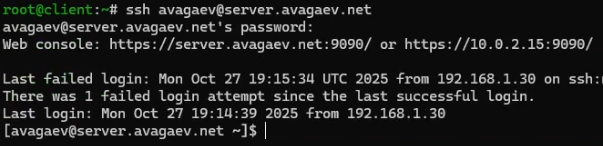{#fig-005 width=70%}

Вход снова успешен.

## Настройка дополнительных портов для удалённого доступа по SSH

Вновь изменил конфигурацию ```/etc/ssh/sshd_config```, открыв доступ по портам 22 и 2022:

```conf
Port 22
Port 2022
```

После перезапустил сервис и посмотрел сообщения в терминале с мониторингом 
системных событий ([рис. @fig-006]):

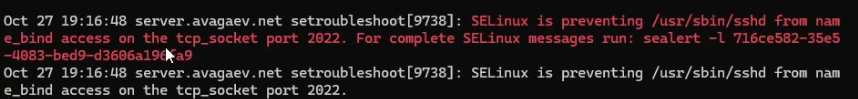{#fig-006 width=70%}

Из сообщения понятно, что SELinux запретил доступ к 2022 порту.

Исправил это, поправив метки на сервере и разрешил порт в межсетевом экране:

```
semanage port -a -t ssh_port_t -p tcp 2022

firewall-cmd --add-port=2022/tcp
firewall-cmd --add-port=2022/tcp --permanent
```

После снова перезапустил сервис и посмотрел его расширенный статус ([рис. @fig-007])

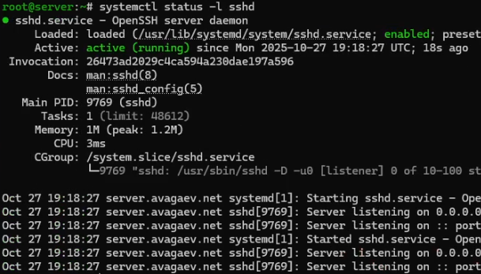{#fig-007 width=70%}

Наконец, проверил работу обоих портов, выполнив вход на сервер ([рис. @fig-008]):

```
ssh avagaev@server.avagaev.net
```

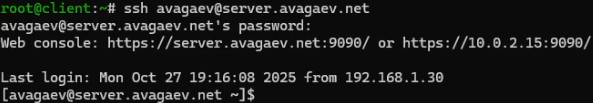{#fig-008 width=70%}

И на 2022 порту ([рис. @fig-009]):

```
ssh -p 2022 avagaev@server.avagaev.net
```

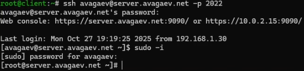{#fig-009 width=70%}

## Настройка удалённого доступа по ключу

Вновь изменил конфигурацию ```/etc/ssh/sshd_config```, включив аутентификацию по ключу:

```conf
PubkeyAuthentication yes
```

Перезапустил службу на сервере и на клиентской ВМ создал пару ключей, используя:

```
ssh-keygen
```

Кодовую фразу я не устанавливал и использовал алгоритм по умолчанию (ed25519). После 
скопировал публичный ключ на сервер:

```
ssh-copy-id avagaev@server.avagaev.net
```

И попробовал зайти на сервер ([рис. @fig-010]):

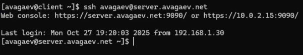{#fig-010 width=70%}

Как можно заметить, на этот раз пароль не запрашивали.

## Организация туннелей SSH, перенаправление TCP-портов

Сначала я посмотрел запущенные службы с протоколом TCP ([рис. @fig-011]):

```
lsof | grep TCP
```

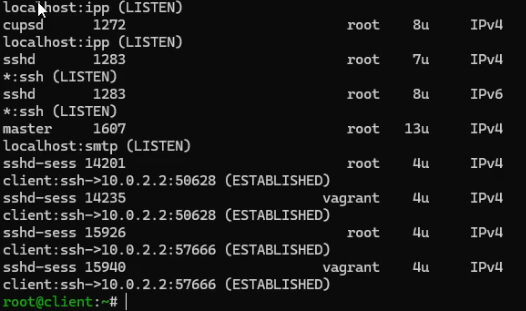{#fig-011 width=70%}

Перенаправил порт 80 на ```server.avagaev.net``` на порт 8080 на локальной машине:

```
ssh -fNL 8080:localhost:80 avagaev@server.avagaev.net
```

И вновь проверил запущенные службы с протоколом TCP ([рис. @fig-012]):

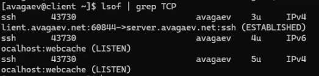{#fig-012 width=70%}

## Запуск консольных приложений через SSH

На ВМ ```client``` под своим пользователем ```avagaev``` выполняю несколько команд.

Посмотрел с клиента имя узла сервера:

```
ssh user@server.user.net hostname
```

Посмотрел с клиента список файлов на сервере:

```
ssh user@server.user.net ls -Al
```

Посмотрел с клиента почту на сервере:

```
ssh user@server.user.net MAIL=~/Maildir/ mail
```

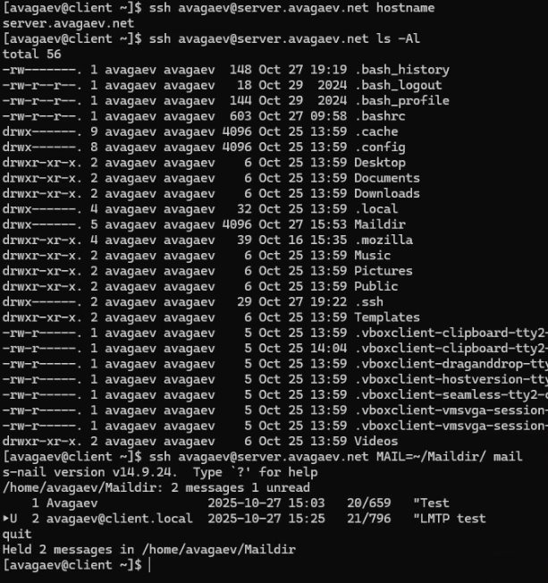{#fig-013 width=70%}

## Запуск графических приложений через SSH

Вновь внес изменения в ```/etc/ssh/sshd_config```, разрешив отображение на локальном 
клиентском компьютере графических интерфейсов X11:

```conf
X11Forwarding yes
```

После перезагрузил sshd и попробовал запустить с клиента графическое приложение:

```
systemctl restart sshd

ssh -YC avagaev@server.avagaev.net firefox
```

## Внесение изменений в настройки внутреннего окружения виртуальной машины

В настройки внутреннего окружения ```/vagrant/provision/server/```:

```
cd /vagrant/provision/server
mkdir -p /vagrant/provision/server/ssh/etc/ssh
cp -R /etc/ssh/sshd_config /vagrant/provision/server/ssh/etc/ssh/

touch ssh.sh
chmod +x ssh.sh
```

В сам файл скрипта ```ssh.sh``` необходимо написать следующее:

```sh
#!/bin/bash

echo "Provisioning script $0"

echo "Copy configuration files"
cp -R /vagrant/provision/server/ssh/etc/* /etc

restorecon -vR /etc

echo "Configure firewall"
firewall-cmd --add-port=2022/tcp
firewall-cmd --add-port=2022/tcp --permanent

echo "Tuning SELinux"
semanage port -a -t ssh_port_t -p tcp 2022

echo "Restart sshd service"
systemctl restart sshd
```

В конфигурацию Vagrantfile внести запуск данного скрипта в секции server:

```
server.vm.provision "server ssh",
type: "shell",
preserve_order: true,
path: "provision/server/ssh.sh"
```

# Выводы

Я приобрёл практические навыки по настройке удалённого доступа к серверу с помощью SSH.
