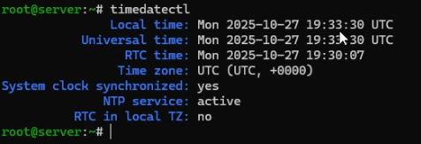
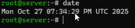
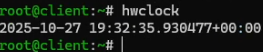
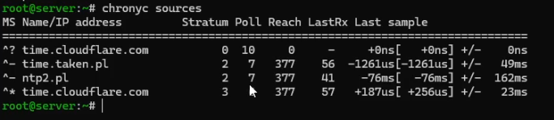
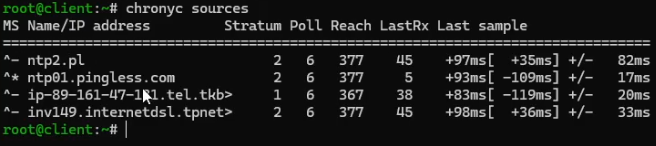

---
## Author
author:
  name: Арсений Валерьевич Агаев
  email: 1032221668@rudn.ru
  affiliation:
    - name: Российский университет дружбы народов
      country: Российская Федерация
      postal-code: 117198
      city: Москва
      address: ул. Миклухо-Маклая, д. 6
## Title
title: Лабораторная работа №12
subtitle: Синхронизация времени
license: CC BY
date: today
date-format: "YYYY-MM-DD" # Example: 2025-09-06
---
# Информация

## Докладчик

:::::::::::::: {.columns align=center}
::: {.column width="70%"}

  * Арсений Валерьевич Агаев
  * студент
  * Российский университет дружбы народов им. П. Лумумбы
  * [1032221668@rudn.ru](mailto:1032221668@rudn.ru)

:::
::: {.column width="30%"}

:::
::::::::::::::

# Цели и задачи

Получить навыки по управлению системным временем и настройке синхронизации времени.

- Изучить команды по настройке параметров времени

- Настроить сервер в качестве сервера синхронизации времени для локальной сети

- Написать скрипты для Vagrant, фиксирующие действия по установке и настройке NTP-сервера и клиента

# Содержание исследования

## Настройка параметров времени

На обеих ВМ посмотрел параметры настройки даты и времени, текущее системное время и аппаратное время:

```
timedatectl

date

hwclock
```

## Настройка параметров времени

{#fig-001 width=70%}

## Настройка параметров времени

{#fig-002 width=70%}

## Настройка параметров времени

{#fig-003 width=70%}

## Настройка параметров времени

{#fig-004 width=70%}

## Настройка параметров времени

{#fig-005 width=70%}

## Настройка параметров времени

{#fig-006 width=70%}

## Управление синхронизацией времени

Утилита ```chrony``` уже была установлена на сервере.

Проверяю источники времени на обеих ВМ:

```
chronyc sources
```

## Управление синхронизацией времени

{#fig-007 width=70%}

## Управление синхронизацией времени

{#fig-008 width=70%}

## Управление синхронизацией времени

На сервере:
Внес изменения в файл ```/etc/chrony.conf```:

```conf
allow 192.168.0.0/16
```

```
systemctl restart chronyd

firewall-cmd --add-service=ntp --permanent
firewall-cmd --reload
```

На клиенте:

Внес изменения в файл ```/etc/chrony.conf```:

```conf
server server.avagaev.net iburst
```

Перезапустил службу:

```
systemctl restart chronyd
```

## Управление синхронизацией времени

{#fig-009 width=70%}

## Управление синхронизацией времени

После посмотрел подробную информацию о синхронизации:

```
chronyc tracking
```

{#fig-010 width=70%}

## Внесение изменений в настройки внутреннего окружения виртуальных машин

На ВМ ```server``` перешел в каталог для внесения изменений в настройки внутреннего окружения
```/vagrant/provision/server/```:

```
cd /vagrant/provision/server

mkdir -p /vagrant/provision/server/ntp/etc
cp -R /etc/chrony.conf /vagrant/provision/server/ntp/etc/

touch ntp.sh
chmod +x ntp.sh
```

## Внесение изменений в настройки внутреннего окружения виртуальных машин

В файл ```ntp.sh``` внес следующий скрипт:

```sh
#!/bin/bash

echo "Provisioning script $0"

echo "Copy configuration files"
cp -R /vagrant/provision/server/ntp/etc/* /etc

restorecon -vR /etc

echo "Configure firewall"
firewall-cmd --add-service=ntp
firewall-cmd --add-service=ntp --permanent

echo "Restart chronyd service"
systemctl restart chronyd
```

## Внесение изменений в настройки внутреннего окружения виртуальных машин

На ВМ ```client``` перешел в каталог для внесения изменений в настройки внутреннего окружения
```/vagrant/provision/client/```:

```
cd /vagrant/provision/client

mkdir -p /vagrant/provision/client/ntp/etc
cp -R /etc/chrony.conf /vagrant/provision/client/ntp/etc/

touch ntp.sh
chmod +x ntp.sh
```

В файл ```ntp.sh``` внес следующий скрипт:

```sh
#!/bin/bash

echo "Provisioning script $0"

echo "Copy configuration files"
cp -R /vagrant/provision/client/ntp/etc/* /etc

restorecon -vR /etc

echo "Restart chronyd service"
systemctl restart chronyd

```

## Внесение изменений в настройки внутреннего окружения виртуальных машин

Для выполнения созданных скриптов, внес изменения в Vagrantfile в соответствующие 
секции конфигурации ```server``` и ```client```

```conf
server.vm.provision "server ntp",
   type: "shell",
   preserve_order: true,
   path: "provision/server/ntp.sh"
...
client.vm.provision "client ntp",
    type: "shell",
    preserve_order: true,
    path: "provision/client/ntp.sh"
```

# Результаты

Я успешно получил навыки по управлению системным временем и настройке синхронизации времени.
