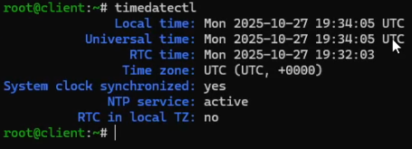
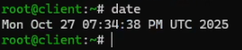
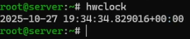
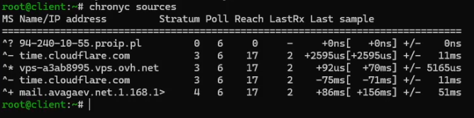
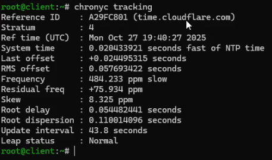

---
## Author
author:
  name: Арсений Валерьевич Агаев
  email: 1032221668@rudn.ru
  affiliation:
    - name: Российский университет дружбы народов
      country: Российская Федерация
      postal-code: 117198
      city: Москва
      address: ул. Миклухо-Маклая, д. 6

## Title
title: "Лабораторная работа №12"
subtitle: "Синхронизация времени"
license: "CC BY"
---

# Цель работы

Получение навыков по управлению системным временем и настройке синхронизации времени.

# Задание

- Изучите команды по настройке параметров времени

- Настройте сервер в качестве сервера синхронизации времени для локальной сети

- Напишите скрипты для Vagrant, фиксирующие действия по установке и настройке NTP-сервера и клиента

# Выполнение лабораторной работы

## Настройка параметров времени

На обеих ВМ посмотрел параметры настройки даты и времени ([рис. @fig-001] и [рис. @fig-002]):

```
timedatectl
```

{#fig-001 width=70%}

{#fig-002 width=70%}

На обеих ВМ посмотрел текущее системное время ([рис. @fig-003] и [рис. @fig-004]):

```
date
```

{#fig-003 width=70%}

{#fig-004 width=70%}

На обеих ВМ посмотрел аппаратное время ([рис. @fig-005] и [рис. @fig-006]):

```
hwclock
```

{#fig-005 width=70%}

{#fig-006 width=70%}

## Управление синхронизацией времени

Утилита ```chrony``` уже была установлена на сервере.

Проверяю источники времени на обеих ВМ ([рис. @fig-007] и [рис. @fig-008]):

```
chronyc sources
```

{#fig-007 width=70%}

{#fig-008 width=70%}

В обоих случаях:

- ^* указывает на текущий выбранный сервер

- ^ возможный источник, который не используется

- ? источник не прислал валидные данные

При этом:

- Name/IP address - откуда берется время

- Stratum уровень точности источника

- Poll интервал опрос

- Reach битовая маска последних 8 попыток

- LastRx сколько секунд прошло с последнего ответа

- Last sample смещение относительно локального времени

Далее я внес изменения на сервере в файл ```/etc/chrony.conf```:

```conf
allow 192.168.0.0/16
```

Перезапустил службу:

```
systemctl restart chronyd
```

И настроил межсетевой экран:

```
firewall-cmd --add-service=ntp --permanent
firewall-cmd --reload
```

На клиентской ВМ также внес изменения в файл ```/etc/chrony.conf```:

```conf
server server.avagaev.net iburst
```

Перезапустил и вновь проверил источники времени на клиенте ([рис. @fig-009]):

{#fig-009 width=70%}

После посмотрел подробную информацию о синхронизации ([рис. @fig-010]):

```
chronyc tracking
```

{#fig-010 width=70%}

Здесь выведена:

- Reference ID идентификатор и IP-адрес (в шестнадцатеричном виде) сервера NTP, с которым
синхронизируется клиент.

- Stratum уровень источника времени

- Ref time (UTC) время последнего обновления (синхронизации) с сервером NTP в формате UTC

- System time локальное системное время

- Last offset последняя измеренная разница между локальными часами и NTP-временем

- RMS offset среднеквадратическое отклонение - показатель стабильности синхронизации

- Frequency показывает, как сильно "дрейфуют" системные часы относительно эталонного времени

- Residual freq оставшееся смещение частоты после учёта корректировок

- Skew неопределённость оценки частоты

- Root delay суммарная задержка (в обе стороны) между клиентом и сервером NTP

- Root dispersion оценка возможной ошибки времени относительно эталона

- Leap status состояние корректировки секунд

## Внесение изменений в настройки внутреннего окружения виртуальных машин

На ВМ ```server``` перешел в каталог для внесения изменений в настройки внутреннего окружения
```/vagrant/provision/server/```:

```
cd /vagrant/provision/server

mkdir -p /vagrant/provision/server/ntp/etc
cp -R /etc/chrony.conf /vagrant/provision/server/ntp/etc/

touch ntp.sh
chmod +x ntp.sh
```

В файл ```ntp.sh``` внес следующий скрипт:

```sh
#!/bin/bash

echo "Provisioning script $0"

echo "Copy configuration files"
cp -R /vagrant/provision/server/ntp/etc/* /etc

restorecon -vR /etc

echo "Configure firewall"
firewall-cmd --add-service=ntp
firewall-cmd --add-service=ntp --permanent

echo "Restart chronyd service"
systemctl restart chronyd
```

На ВМ ```client``` перешел в каталог для внесения изменений в настройки внутреннего окружения
```/vagrant/provision/client/```:

```
cd /vagrant/provision/client

mkdir -p /vagrant/provision/client/ntp/etc
cp -R /etc/chrony.conf /vagrant/provision/client/ntp/etc/

touch ntp.sh
chmod +x ntp.sh
```

В файл ```ntp.sh``` внес следующий скрипт:

```sh
#!/bin/bash

echo "Provisioning script $0"

echo "Copy configuration files"
cp -R /vagrant/provision/client/ntp/etc/* /etc

restorecon -vR /etc

echo "Restart chronyd service"
systemctl restart chronyd

```

Для выполнения созданных скриптов, внес изменения в Vagrantfile в соответствующие 
секции конфигурации ```server``` и ```client```

```conf
server.vm.provision "server ntp",
   type: "shell",
   preserve_order: true,
   path: "provision/server/ntp.sh"
...
client.vm.provision "client ntp",
    type: "shell",
    preserve_order: true,
    path: "provision/client/ntp.sh"
```

# Выводы

Я получил навыки по управлению системным временем и настройке синхронизации времени.
