---
## Author
author:
  name: Арсений Валерьевич Агаев
  email: 1032221668@rudn.ru
  affiliation:
    - name: Российский университет дружбы народов
      country: Российская Федерация
      postal-code: 117198
      city: Москва
      address: ул. Миклухо-Маклая, д. 6
## Title
title: Лабораторная работа №13
subtitle: Настройка NFS
license: CC BY
date: today
date-format: "YYYY-MM-DD" # Example: 2025-09-06
---
# Информация

## Докладчик

:::::::::::::: {.columns align=center}
::: {.column width="70%"}

  * Арсений Валерьевич Агаев
  * студент
  * Российский университет дружбы народов им. П. Лумумбы
  * [1032221668@rudn.ru](mailto:1032221668@rudn.ru)

:::
::: {.column width="30%"}

:::
::::::::::::::

# Цели и задачи

Приобрести навыки настройки сервера NFS для удалённого доступа к ресурсам.

- Установить и настроить сервер NFSv4

- Подмонтировать удалённый ресурс на клиенте

- Подключить каталог с контентом веб-сервера к дереву NFS

- Написать скрипты для Vagrant, фиксирующие действия данной работы

# Содержание исследования

## Настройка сервера NFSv4

Сначала установил необходимые утилиты:

```
dnf -y install nfs-utils
```

После создал каталог, который будет доступен всем пользователем сети:

```
mkdir -p /srv/nfs
```

В файле ```/etc/exports``` прописиваю данный каталог только на чтение:

```conf
/srv/nfs *(ro)
```

## Настройка сервера NFSv4

Создаю контекст безопасности NFS для общего каталога:

```
semanage fcontext -a -t nfs_t "/srv/nfs(/.*)?"
```

После применяю изменения SELinux:

```
restorecon -vR /srv/nfs
```

И запускаю сервер NFS

```
systemctl enable nfs-server.service
systemctl start nfs-server.service
```

## Настройка сервера NFSv4

Также настраиваю firewalld для работы с сервером:

```
firewall-cmd --add-service=nfs
firewall-cmd --add-service=nfs --permanent
firewall-cmd --reload
```

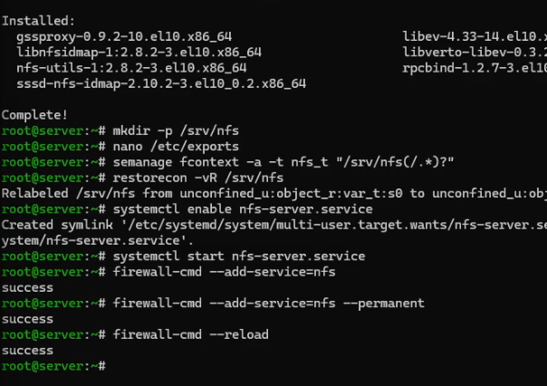{#fig-001 width=70%}

## Настройка сервера NFSv4

На клиенте также устанливаю утилиту:

```
dnf -y install nfs-utils
```

Пробую посмотреть подмонтированный каталог:

```
showmount -e server.avagaev.net
```

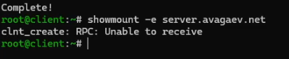{#fig-002 width=70%}

Как можно понять из сообщения, каталог недоступен для подключения.

## Настройка сервера NFSv4

Попробовал остановить межсетевой экран на сервере:

```
systemctl stop firewalld.service
```

И вновь попробовал подключиться:

```
showmount -e server.avagaev.net
```

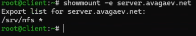{#fig-003 width=70%}

Теперь подключение выполнено успешно.

## Настройка сервера NFSv4

Обратно запустил межсетевой экран:

```
systemctl start firewalld.service
```

Добавил службы ```rpc-bind``` и ```mountd``` в настройки firewalld:

```
firewall-cmd --add-service=mountd --add-service=rpc-bind
firewall-cmd --add-service=mountd --add-service=rpc-bind --permanent
firewall-cmd --reload
```

## Настройка сервера NFSv4

И снова попробовал подключиться:

```
showmount -e server.avagaev.net
```

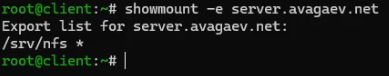{#fig-004 width=70%}

## Монтирование NFS на клиенте

Создал каталог на клиенте, в который будет монтироваться удалённый ресурс:

```
mkdir -p /mnt/nfs
mount server.avagaev.net:/srv/nfs /mnt/nfs
```

И после проверил, что общий ресурс NFS подключён правильно ([рис. @fig-005]):

```
mount
```

## Монтирование NFS на клиенте

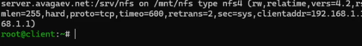{#fig-005 width=70%}

## Монтирование NFS на клиенте

Добавил строку в файл ```/etc/fstab```:

```conf
server.avagaev.net:/srv/nfs /mnt/nfs nfs _netdev 0 0
```

На клиенте проверил автоматическое монтирование удалённых ресурсов при запуске ОС ([рис. @fig-006]):

```
systemctl status remote-fs.target
```

## Монтирование NFS на клиенте

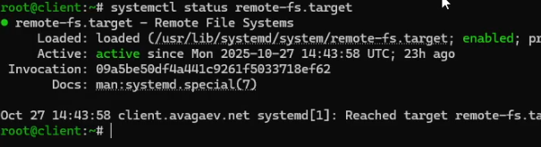{#fig-006 width=70%}

## Подключение каталогов к дереву NFS

На сервере создал общий каталог, в который будет подмонтирован каталог с контентом веб-сервера, 
и подмонтировал его. После проверил, что отображается в каталоге ```/srv/nfs```:

```
mkdir -p /srv/nfs/www
mount -o bind /var/www/ /srv/nfs/www/
ls /srv/nfs
```

## Подключение каталогов к дереву NFS

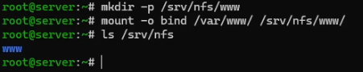{#fig-007 width=70%}

## Подключение каталогов к дереву NFS

На клиенте проверил, что отображается в каталоге ```/mnt/nfs```:

```
ls /mnt/nfs
```

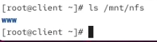{#fig-008 width=70%}

## Подключение каталогов к дереву NFS

После добавил в ```/etc/exports```:

```conf
/srv/nfs/www 192.168.0.0/16(rw)
```

И экспортировал все каталоги, упомянутые в предыдущем файле:

```
exportfs -r
```

## Подключение каталогов к дереву NFS

Снова проверил, что отображается в каталоге ```/mnt/nfs```:

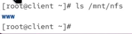{#fig-009 width=70%}

## Подключение каталогов к дереву NFS

На сервере добавил в файл ```/etc/fstab```:

```conf
/var/www /srv/nfs/www none bind 0 0
```

И повторно экспортировал каталоги:

```
exportfs -r
```

## Подключение каталогов к дереву NFS

Снова проверил, что отображается в каталоге ```/mnt/nfs``` на клиенте:

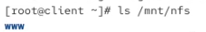{#fig-010 width=70%}

## Подключение каталогов для работы пользователей

На сервере под своим пользователем avagaev создал каталог ```common``` с полными 
правами доступа только для него, а в нём файл ```avagaev@server.txt```:

```
mkdir -p -m 700 ~/common
cd ~/common
touch avagaev@server.txt
```

Также создал общий каталог для работы пользователя и подмонтировал ее в NFS:

```
mkdir -p /srv/nfs/home/avagaev
mount -o bind /home/avagaev/common /srv/nfs/home/avagaev
```
## Подключение каталогов для работы пользователей

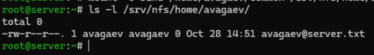{#fig-011 width=70%}

## Подключение каталогов для работы пользователей

После добавил каталог в файл ```/etc/exports```:

```conf
/srv/nfs/home/avagaev 192.168.0.0/16(rw)
```

Добавил строку в ```/etc/fstab```:

```conf
/home/avagaev/common /srv/nfs/home/avagaev none bind 0 0
```

И повторно экспортировал каталоги:

```
exportfs -r
```

## Подключение каталогов для работы пользователей

На клиенте проверил каталог ```/mnt/nfs```:

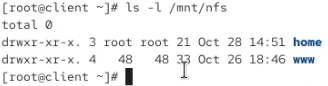{#fig-012 width=70%}

## Подключение каталогов для работы пользователей

На клиенте под своим пользователем в каталоге ```/mnt/nfs/home/avagaev``` 
создал файл ```avagaev@client.txt```:

```
cd /mnt/nfs/home/avagaev
touch avagaev@client.txt
```

## Подключение каталогов для работы пользователей

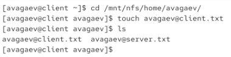{#fig-013 width=70%}

Под пользователем root получил ошибку прав уже при чтении.

## Подключение каталогов для работы пользователей

Проверил изменения на сервере:

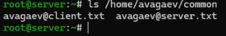{#fig-014 width=70%}

## Внесение изменений в настройки внутреннего окружения виртуальных машин

На ВМ ```server``` перешел в каталог для внесения изменений в настройки внутреннего окружения 
```/vagrant/provision/server``` и зафиксировал проведенную работу:

```
cd /vagrant/provision/server

mkdir -p /vagrant/provision/server/nfs/etc
cp -R /etc/exports /vagrant/provision/server/nfs/etc/

touch nfs.sh
chmod +x nfs.sh
```

## Внесение изменений в настройки внутреннего окружения виртуальных машин

В файл ```/vagrant/provision/server/nfs.sh``` записал скрипт:

```sh
#!/bin/bash

echo "Provisioning script $0"

echo "Install needed packages"
dnf -y install nfs-utils

echo "Copy configuration files"
cp -R /vagrant/provision/server/nfs/etc/* /etc

restorecon -vR /etc

echo "Configure firewall"
firewall-cmd --add-service nfs --permanent
firewall-cmd --add-service mountd --add-service rpc-bind --permanent
firewall-cmd --reload

echo "Tuning SELinux"
mkdir -p /srv/nfs
semanage fcontext -a -t nfs_t "/srv/nfs(/.*)?"
restorecon -vR /srv/nfs

echo "Mounting dirs"
mkdir -p /srv/nfs/www
mount -o bind /var/www /srv/nfs/www
echo "/var/www /srv/nfs/www none bind 0 0" >> /etc/fstab
mkdir -p /srv/nfs/home/avagaev
mkdir -p -m 700 /home/avagaev/common
chown avagaev:avagaev /home/avagaev/common
mount -o bind /home/avagaev/common /srv/nfs/home/avagaev
echo "/home/avagaev/common /srv/nfs/home/avagaev none bind 0 0" >> /etc/fstab

echo "Start nfs service"
systemctl enable nfs-server
systemctl start nfs-server

systemctl restart firewalld
```

## Внесение изменений в настройки внутреннего окружения виртуальных машин

Аналогично для ВМ ```client```:

```
cd /vagrant/provision/client
touch nfs.sh
chmod +x nfs.sh
```

В файл ```/vagrant/provision/client/nfs.sh``` записал скрипт:

```sh
#!/bin/bash

echo "Provisioning script $0"

echo "Install needed packages"
dnf -y install nfs-utils

echo "Mounting dirs"
mkdir -p /mnt/nfs
mount server.avagaev.net:/srv/nfs /mnt/nfs
echo "server.avagaev.net:/srv/nfs /mnt/nfs nfs _netdev 0 0" >> /etc/fstab
restorecon -vR /etc
```

## Внесение изменений в настройки внутреннего окружения виртуальных машин

Для отработки данных скриптов, внес изменения в Vagrantfile в соответсвующие секции:

```conf
server.vm.provision "server nfs",
   type: "shell",
   preserve_order: true,
   path: "provision/server/nfs.sh"
...
client.vm.provision "client nfs",
   type: "shell",
   preserve_order: true,
   path: "provision/client/nfs.sh"
```

# Результаты

Я успешно приобрёл навыки настройки сервера NFS для удалённого доступа к ресурсам.
