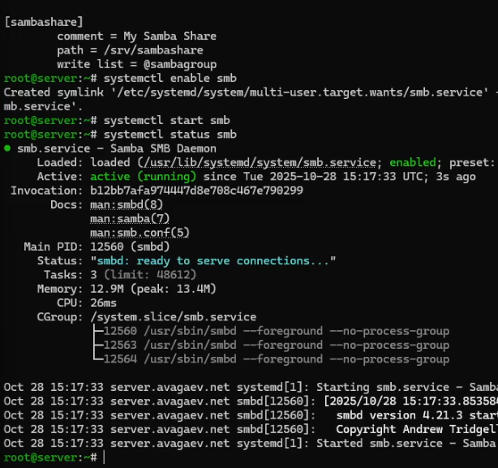
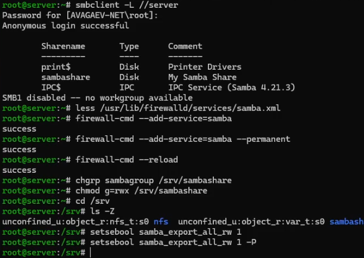
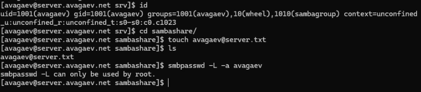
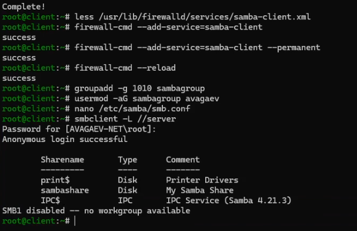
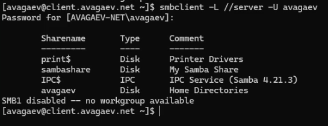
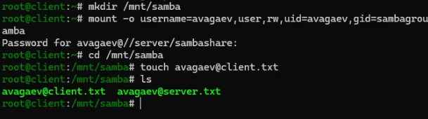
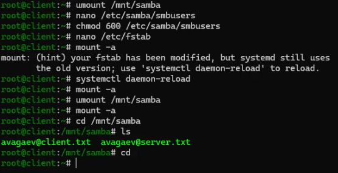

---
## Author
author:
  name: Арсений Валерьевич Агаев
  email: 1032221668@rudn.ru
  affiliation:
    - name: Российский университет дружбы народов
      country: Российская Федерация
      postal-code: 117198
      city: Москва
      address: ул. Миклухо-Маклая, д. 6
## Title
title: Лабораторная работа №14
subtitle: Настройка файловых служб Samba
license: CC BY
date: today
date-format: "YYYY-MM-DD" # Example: 2025-09-06
---
# Информация

## Докладчик

:::::::::::::: {.columns align=center}
::: {.column width="70%"}

  * Арсений Валерьевич Агаев
  * студент
  * Российский университет дружбы народов им. П. Лумумбы
  * [1032221668@rudn.ru](mailto:1032221668@rudn.ru)

:::
::: {.column width="30%"}

:::
::::::::::::::

# Цели и задачи

Приобрести навыки настройки доступа групп пользователей к общим ресурсам по протоколу SMB.

- Установить и настроить сервер Samba

- Настроить на клиенте доступ к разделяемым ресурсам

- Написать скрипты для Vagrant, фиксирующие выполненые действия работы

# Содержание исследования

## Настройка сервера Samba

Сначала установил необходимые пакеты:

```
dnf -y install samba samba-client cifs-utils
```

После создал группу ```sambagroup``` для пользователей, которые будут работать с Samba-сервером:

```
groupadd -g 1010 sambagroup
```

И добавил своего пользователя в эту группу:

```
usermod -aG sambagroup avagaev
```

После создал общий каталог в файловой системе Linux:

```
mkdir -p /srv/sambashare
```

## Настройка сервера Samba

Изменил конфигурационный файл ```/etc/samba/smb.conf```:

```conf
[global]
workgroup = AVAGAEV-NET
...
[sambashare]
comment = My Samba Share
path = /srv/sambashare
write list = @sambagroup
```

После проверил, что не допусил ошибок:

```
testparm
```

Наконец, запустил Samba:

```
systemctl enable smb
systemctl start smb
systemctl status smb
```

## Настройка сервера Samba

{#fig-001 width=70%}

## Настройка сервера Samba

Проверил наличие общего доступа (анонимным пользователем):

```
smbclient -L //server
```

И после настроил firewalld:

```
firewall-cmd --add-service=samba
firewall-cmd --add-service=samba --permanent
firewall-cmd --reload
```

Настроил права доступа для каталога:

```
chgrp sambagroup /srv/sambashare
chmod g=rwx /srv/sambashare
```

## Настройка сервера Samba

Настроил контекст безопасности SELinux:

```
semanage fcontext -a -t samba_share_t "/srv/sambashare(/.*)?"
restorecon -vR /srv/sambashare
```

Проверил контекст безопасности:

```
cd /srv
ls -Z
```

После разрешил экспортировать разделяемые ресурсы для чтения и записи:

```
setsebool samba_export_all_rw 1
setsebool samba_export_all_rw 1 -P
```

## Настройка сервера Samba

{#fig-002 width=70%}

## Настройка сервера Samba

Теперь проверил, в какие группы включен мой пользователь:

```
id
```

Попробовал создать файл в разделяемом каталоге:

```
cd /srv/sambashare
touch avagaev@server.txt
```

И добавил своего пользователя в базу пользователей Samba

```
smbpasswd -L -a avagaev
```

## Настройка сервера Samba

{#fig-003 width=70%}

## Монтирование файловой системы Samba на клиенте

Сначала установил необходимые пакеты:

```
dnf -y install samba-client cifs-utils
```

И настроил firewalld:

```
firewall-cmd --add-service=samba-client
firewall-cmd --add-service=samba-client --permanent
firewall-cmd --reload
```

После создал группу ```sambagroup``` и добавил своего пользователя:

```
groupadd -g 1010 sambagroup
usermod -aG sambagroup avagaev
```

Изменил конфигурационный файл ```/etc/samba/smb.conf```:

```conf
[global]
workgroup = AVAGAEV-NET
```

## Монтирование файловой системы Samba на клиенте

Попробовал подлючиться к серверу:

```
smbclient -L //server
```

{#fig-004 width=70%}

## Монтирование файловой системы Samba на клиенте

Попробовал подключиться с указанием пользователя:

```
smbclient -L //server
```

{#fig-005 width=70%}

## Монтирование файловой системы Samba на клиенте

Теперь на клиенте создал точку монтирования:

```
mkdir /mnt/samba
```

Получил доступ к общему ресурсу с помощью mount:

```
mount -o username=avagaev,user,rw,uid=avagaev,gid=sambagroup //server/sambashare /mnt/samba
```

Попробовал записать файл в данный каталог:

```
cd /mnt/samba
touch avagaev@client.txt
```

## Монтирование файловой системы Samba на клиенте

{#fig-006 width=70%}

## Монтирование файловой системы Samba на клиенте

Отмонтировал каталог:

```
umount /mnt/samba
```

И настроил работу с Samba с помощью файла учётных данных.

Для этого создал файл ```smbusers``` в каталоге ```/etc/samba/```:

```
touch /etc/samba/smbusers
chmod 600 /etc/samba/smbusers
```

В который записал данные от аккаунта:

```conf
username=avagaev
password=Street200!
```

Также в файл ```/etc/fstab``` добавил строку:

```conf
//server/sambashare /mnt/samba cifs \
user,rw,uid=avagaev,gid=sambagroup,credentials=/etc/samba/smbusers,_netdev 0 0
```

## Монтирование файловой системы Samba на клиенте

И снова попробовал подмонтировать ресурс:

{#fig-007 width=70%}

## Внесение изменений в настройки внутреннего окружения виртуальных машин

На ВМ ```server``` перешел в каталог для внесения изменений в настройки внутреннего окружения 
```/vagrant/provision/server``` и зафиксировал проведенную работу:

```
cd /vagrant/provision/server

mkdir -p /vagrant/provision/server/smb/etc/samba
cp -R /etc/samba/smb.conf /vagrant/provision/server/smb/etc/samba/

touch smb.sh
chmod +x smb.sh
```

## Внесение изменений в настройки внутреннего окружения виртуальных машин

В файл ```/vagrant/provision/server/smb.sh``` записал скрипт:

```sh
#!/bin/bash

LOGIN=avagaev
PASS=Street200!

echo "Provisioning script $0"

echo "Install needed packages"
dnf -y install samba samba-client cifs-utils

echo "Copy configuration files"
cp -R /vagrant/provision/server/smb/etc/* /etc
chown -R root:root /etc/samba/*
restorecon -vR /etc

echo "Configure firewall"
firewall-cmd --add-service samba --permanent
firewall-cmd --reload

echo "Users and groups"
groupadd -g 1010 sambagroup
usermod -aG sambagroup $LOGIN
echo -ne "$PASS\n$PASS\n" | smbpasswd -L -a -s $LOGIN

echo "Make share dir"
mkdir -p /srv/sambashare
chgrp sambagroup /srv/sambashare
chmod g=rwx /srv/sambashare

echo "Tuning SELinux"
semanage fcontext -a -t samba_share_t "/srv/sambashare(/.*)?"

setsebool samba_export_all_rw 1
setsebool samba_export_all_rw 1 -P

restorecon -vR /srv/sambashare

echo "Start smb service"
systemctl enable smb
systemctl start smb

systemctl restart firewalld
```

## Внесение изменений в настройки внутреннего окружения виртуальных машин

Аналогично для ВМ ```client```:

```
cd /vagrant/provision/client

mkdir -p /vagrant/provision/client/smb/etc/samba
cp -R /etc/samba/smb.conf /vagrant/provision/client/smb/etc/samba/
cp -R /etc/samba/smbusers /vagrant/provision/client/smb/etc/samba/

touch smb.sh
chmod +x smb.sh
```

## Внесение изменений в настройки внутреннего окружения виртуальных машин

В файл ```/vagrant/provision/client/smb.sh``` записал скрипт:

```sh
#!/bin/bash

LOGIN=avagaev

echo "Provisioning script $0"

mkdir -p /mnt/samba

echo "Install needed packages"
dnf -y install samba-client cifs-utils

echo "Copy configuration files"
cp -R /vagrant/provision/client/smb/etc/* /etc
chown -R root:root /etc/samba/*
restorecon -vR /etc

echo "Configure firewall"
firewall-cmd --add-service samba-client --permanent
firewall-cmd --reload

echo "Users and groups"
groupadd -g 1010 sambagroup
usermod -aG sambagroup $LOGIN

echo "Mounting dirs"
mkdir -p /srv/sambashare
echo "//server/sambashare /mnt/samba cifs \
user,rw,credentials=/etc/samba/smbusers,uid=user, \
gid=sambagroup,_netdev 0 0" >> /etc/fstab

restorecon -vR /etc

umount /mnt/samba
mount /mnt/samba
```

## Внесение изменений в настройки внутреннего окружения виртуальных машин

Для отработки данных скриптов, внес изменения в Vagrantfile в соответсвующие секции:

```conf
server.vm.provision "SMB server",
   type: "shell",
   preserve_order: true,
   path: "provision/server/smb.sh"
...
client.vm.provision "SMB client",
   type: "shell",
   preserve_order: true,
   path: "provision/client/smb.sh"
```

# Результаты

Я  успешно приобрёл навыки настройки доступа групп пользователей к общим ресурсам по протоколу SMB.
