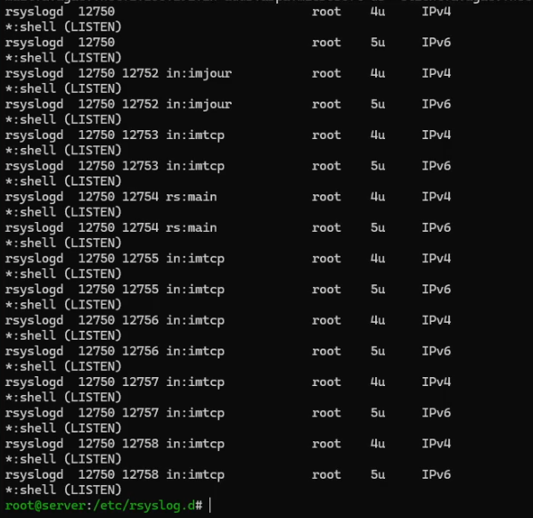
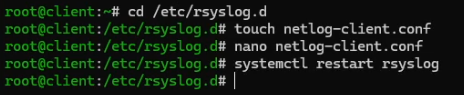
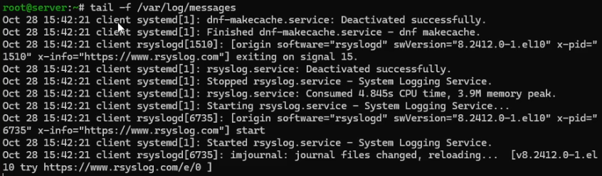
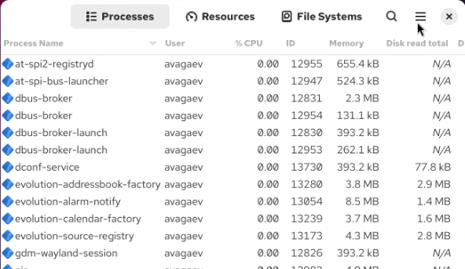

---
## Author
author:
  name: Арсений Валерьевич Агаев
  email: 1032221668@rudn.ru
  affiliation:
    - name: Российский университет дружбы народов
      country: Российская Федерация
      postal-code: 117198
      city: Москва
      address: ул. Миклухо-Маклая, д. 6

## Title
title: "Лабораторная работа №15"
subtitle: "Настройка сетевого журналирования"
license: "CC BY"
---

# Цель работы

Получить навыки по работе с журналами системных событий.

# Задание

- Настроить сервер сетевого журналирования событий

- Настроить клиент для передачи системных сообщений в сетевой журнал на сервере

- Просмотреть журналы системных событий с помощью нескольких программ

- Написать скрипты для Vagrant, фиксирующие действия по установке и настройке сетевого сервера журналирования

# Выполнение лабораторной работы

## Настройка сервера сетевого журнала

На сервере создал файл конфигурации сетевого хранения журналов:

```
cd /etc/rsyslog.d
touch netlog-server.conf
```

Включил приём записей журнала, написав в созданном файле:

```conf
$ModLoad imtcp
$InputTCPServerRun 514
```

После перезапустил службу rsyslog и посмотрел, какие порты с ним связаны:

```
systemctl restart rsyslog

lsof | grep TCP
```

{#fig-001 width=70%}

Также настроил firewalld на 514 порт:

```
firewall-cmd --add-port=514/tcp
firewall-cmd --add-port=514/tcp --permanent
```

## Настройка клиента сетевого журнала

Аналогично, на клиенте создаю файл конфигурации сетевого хранения журналов:

```
cd /etc/rsyslog.d
touch netlog-client.conf
```

В созданном файле записал:

```
*.* @@server.avagaev.net:514
```

И перезапустил службу rsyslog

```
systemclt restart rsyslog
```

{#fig-002 width=70%}

## Просмотр журнала

На сервере посмротрел один из файлов журнала:

```
tail -f /var/log/messages
```

{#fig-003 width=70%}

В графической программе ```gnome-system-monitor```:

{#fig-004 width=70%}

Пакет lnav не был найдет в репозиториях. Его аналогом также является tail.

## Внесение изменений в настройки внутреннего окружения виртуальных машин

На ВМ ```server``` перешел в каталог для внесения изменений в настройки внутреннего окружения 
```/vagrant/provision/server``` и зафиксировал проведенную работу:

```
cd /vagrant/provision/server

mkdir -p /vagrant/provision/server/netlog/etc/rsyslog.d
cp -R /etc/rsyslog.d/netlog-server.conf \
   /vagrant/provision/server/netlog/etc/rsyslog.d

touch netlog.sh
chmod +x netlog.sh
```

В файл ```/vagrant/provision/server/netlog.sh``` записал скрипт:

```sh
#!/bin/bash

echo "Provisioning script $0"

echo "Copy configuration files"
cp -R /vagrant/provision/server/netlog/etc/* /etc
restorecon -vR /etc

echo "Configure firewall"
firewall-cmd --add-port=514/tcp
firewall-cmd --add-port=514/tcp --permanent

echo "Start rsyslog service"
systemctl restart rsyslog
```

Аналогично для ВМ ```client```:

```
cd /vagrant/provision/client

mkdir -p /vagrant/provision/client/netlog/etc/rsyslog.d
cp -R /etc/rsyslog.d/netlog-client.conf \
    /vagrant/provision/client/netlog/etc/rsyslog.d/

touch netlog.sh
chmod +x netlog.sh
```

В файл ```/vagrant/provision/client/netlog.sh``` записал скрипт:

```sh
#!/bin/bash

echo "Provisioning script $0"

echo "Install needed packages"
dnf -y install lnav

echo "Copy configuration files"
cp -R /vagrant/provision/client/netlog/etc/* /etc
restorecon -vR /etc

echo "Start rsyslog service"
systemctl restart rsyslog
```

Для отработки данных скриптов, внес изменения в Vagrantfile в соответсвующие секции:

```conf
server.vm.provision "server netlog",
   type: "shell",
   preserve_order: true,
   path: "provision/server/netlog.sh"
...
client.vm.provision "client netlog",
   type: "shell",
   preserve_order: true,
   path: "provision/client/netlog.sh"
```

# Выводы

Я получил навыки по работе с журналами системных событий.

