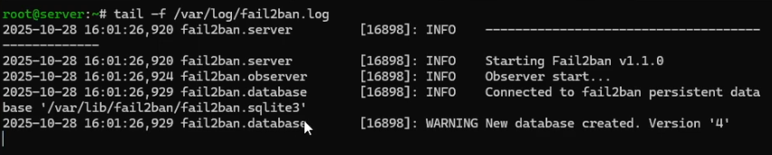
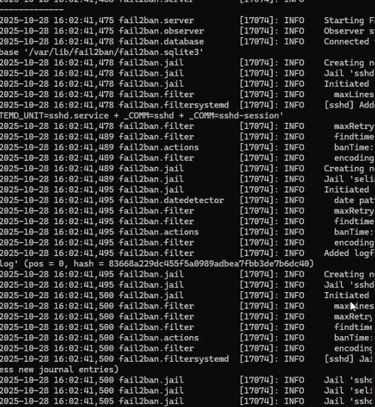
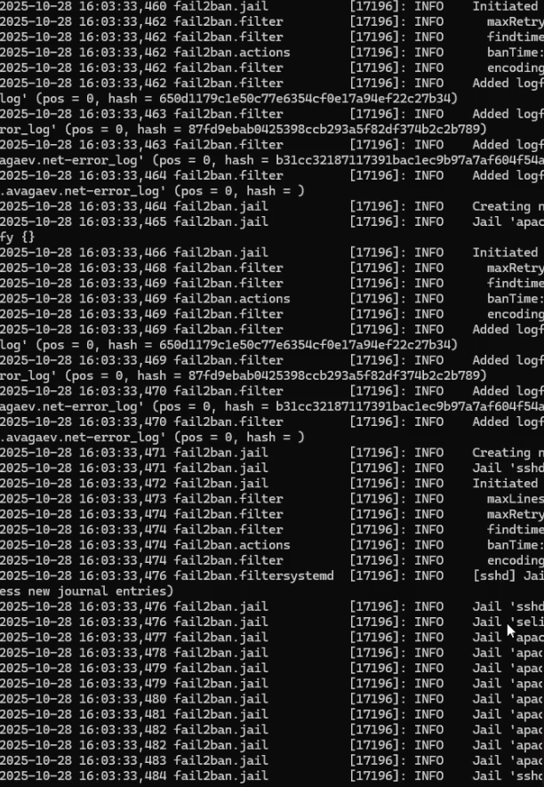
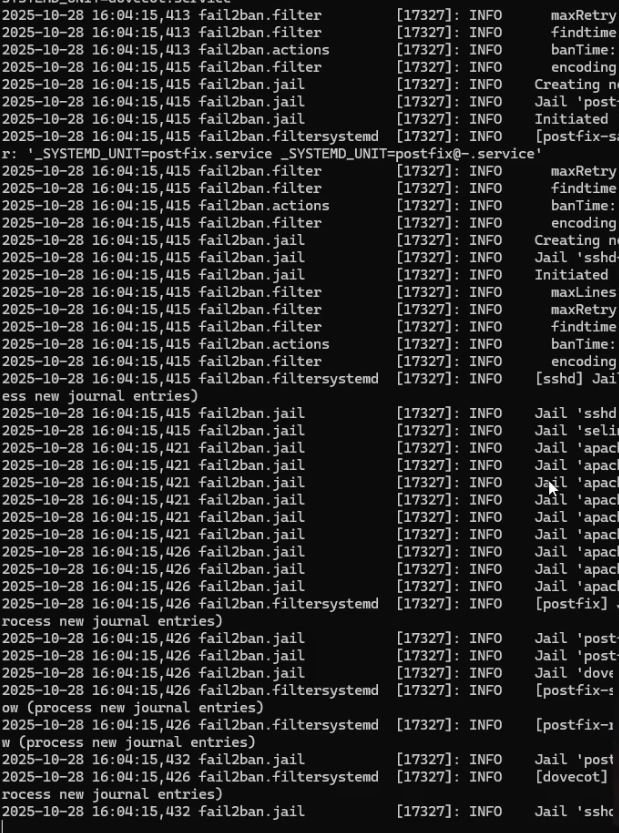
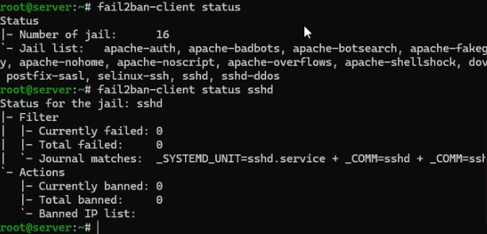
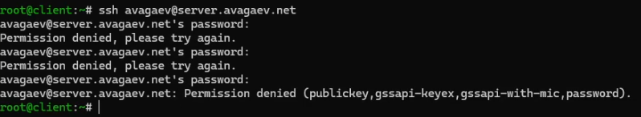
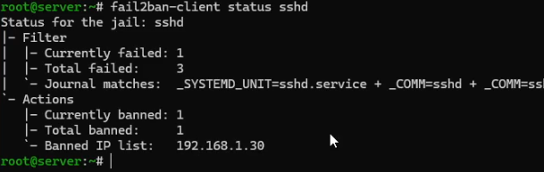
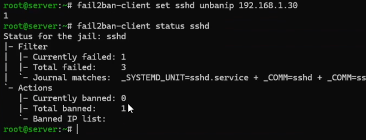
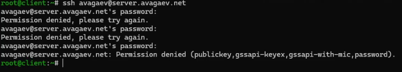
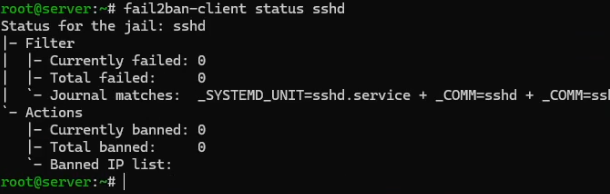

---
## Author
author:
  name: Арсений Валерьевич Агаев
  email: 1032221668@rudn.ru
  affiliation:
    - name: Российский университет дружбы народов
      country: Российская Федерация
      postal-code: 117198
      city: Москва
      address: ул. Миклухо-Маклая, д. 6

## Title
title: "Лабораторная работа №16"
subtitle: "Базовая защита от атак типа «brute force»"
license: "CC BY"
---

# Цель работы

Получить навыки работы с программным средством Fail2ban для обеспечения 
базовой защиты от атак типа «brute force».

# Задание

- Установить и настроить Fail2ban для отслеживания работы установленных на сервере служб

- Проверить работу Fail2ban посредством попыток несанкционированного доступа с клиента на сервер через SSH

- Напишите скрипт для Vagrant, фиксирующий действия по установке и настройке Fail2ban

# Выполнение лабораторной работы

## Защита с помощью Fail2ban

На ВМ ```server``` установил fail2ban:

```
dnf -y install fail2ban
```

Запустил сервер fail2ban:

```
systemctl enable fail2ban
systemctl start fail2ban
```

В дополнительном терминале запустил просмотр журнала событий fail2ban ([рис. @fig-001]):

```
tail -f /var/log/fail2ban.log
```

{#fig-001 width=70%}

Создал файл с локальной конфигурацией fail2ban:

```
touch /etc/fail2ban/jail.d/customisation.local
```

В данный файл записал:

```conf
[DEFAULT]
bantime = 3600

[sshd]
port = ssh,2022
enabled = true

[sshd-ddos]
filter = sshd
enabled = true

[selinux-ssh]
enabled = true
```

Перезапустил службу и проверил журнал событий:

{#fig-002 width=70%}

Продолжил вносить изменения в файл конфигурации:

```conf
[apache-auth]
enabled = true

[apache-badbots]
enabled = true

[apache-noscript]
enabled = true

[apache-overflows]
enabled = true

[apache-nohome]
enabled = true

[apache-botsearch]
enabled = true

[apache-fakegooglebot]
enabled = true

[apache-modsecurity]
enabled = true

[apache-shellshock]
enabled = true
```

Снова перезапустил службу и проверил журнал событий:

{#fig-003 width=70%}

Продолжил вностить изменения в файл конфигурации:

```conf
[postfix]
enabled = true

[postfix-rbl]
enabled = true

[dovecot]
enabled = true

[postfix-sasl]
enabled = true
```

Снова перезапустил службу и проверил журнал событий:

{#fig-004 width=70%}

## Проверка работы Fail2ban

На сервере проверил статус fail2ban и статус защиты SSH в fail2ban:

```
fail2ban-client status

fail2ban-client status sshd
```

{#fig-005 width=70%}

После установил максимальное количество ошибок для SSH на 2:

```
fail2ban-client set sshd maxretry 2
```

Попытался зайти на сервер с клиента посредством SSH:

{#fig-006 width=70%}

Проверил, что клиент был заблокирован:
 
```
fail2ban-client status sshd
```
 
{#fig-007 width=70%}

Разблокировал клиента и снова проверил статус:

```
fail2ban-client set sshd unbanip 192.168.1.30

fail2ban-client status sshd
```

{#fig-008 width=70%}

Внес изменения в конфигурационный файл, добавив клиента в исключения:

```conf
[DEFAULT]
bantime = 3600

ignoreip = 127.0.0.1/8 192.168.1.30
```

И перезапустил службу:

```
systemctl restart fail2ban
```

Вновь попытлся зайти на сервер с клиента посредством SSH:

{#fig-009 width=70%}

{#fig-010 width=70%}

## Внесение изменений в настройки внутреннего окружения виртуальных машин

На ВМ ```server``` перешел в каталог для внесения изменений в настройки внутреннего окружения 
```/vagrant/provision/server``` и зафиксировал проведенную работу:

```
cd /vagrant/provision/server

mkdir -p /vagrant/provision/server/protect/etc/fail2ban/jail.d
cp -R /etc/fail2ban/jail.d/customisation.local \
   /vagrant/provision/server/protect/etc/fail2ban/jail.d/

touch protect.sh
chmod +x protect.sh
```

В файл ```/vagrant/provision/server/protect.sh``` записал скрипт:

```sh
#!/bin/bash

echo "Provisioning script $0"

echo "Install needed packages"
dnf -y install fail2ban

echo "Copy configuration files"
cp -R /vagrant/provision/server/protect/etc/* /etc
restorecon -vR /etc

echo "Start fail2ban service"
systemctl enable fail2ban
systemctl start fail2ban
```

Для отработки данных скриптов, внес изменения в Vagrantfile в соответсвующую секцию:

```conf
server.vm.provision "server protect",
   type: "shell",
   preserve_order: true,
   path: "provision/server/protect.sh"
```

# Выводы

Я получил навыки работы с программным средством Fail2ban для обеспечения 
базовой защиты от атак типа «brute force».
